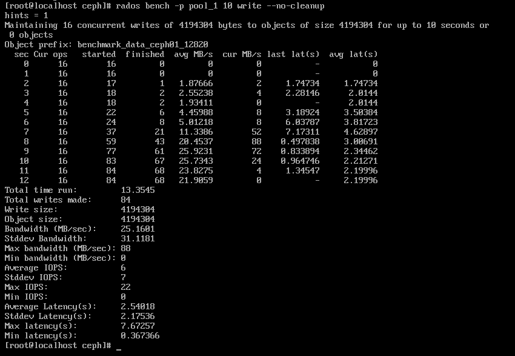
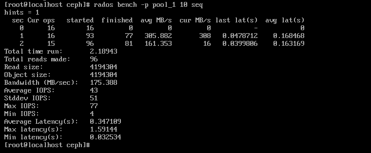
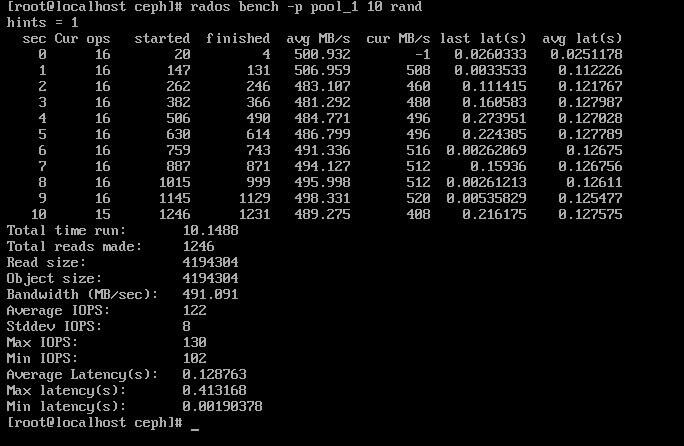
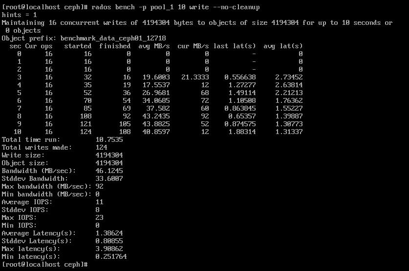
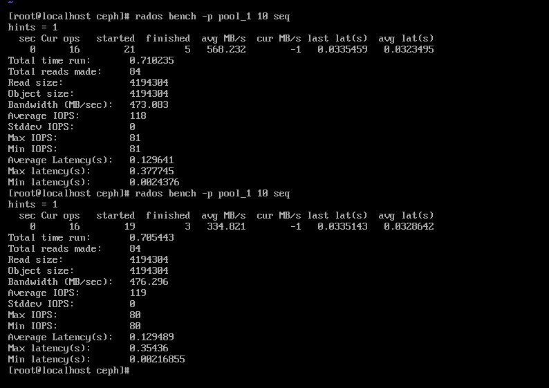
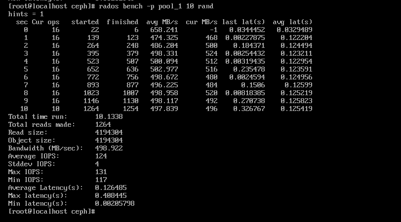

# 默认配置下的性能测试

USTC OSH-2021-x-DisGraFS小组 黄晋超

使用Rados性能测试工具进行写测试，顺序读测试，随机读测试。

## 写测试

## 

## 顺序读



## 随机读



# 配置参数修改优化

在ceph.conf中修改一些默认参数

1. ### **认证配置参数**

   ```
   auth_service_required = none
   auth_client_required = none
   auth_cluster_required = none
   ```

   以上是Ceph authentication的配置参数，默认值为开启ceph认证；

   在内部使用的ceph集群中一般配置为none，即不使用认证，这样能适当加快ceph集群访问速度；

2. ### filestore fd cache配置参数

   ```
   filestore_fd_cache_shards = 32
   filestore_fd_cache_size = 32768
   ```

   filestore的fd cache是加速访问filestore里的file的，在非一次性写入的应用场景，增大配置可以很明显的提升filestore的性能；

3. ### osd scrub配置参数

   ```
   osd_scrub_begin_hour = 2
   osd_scrub_end_hour = 6
   osd_scrub_sleep = 2 
   osd_scrub_load_threshold = 5 
   osd_scrub_chunk_min = 5
   osd_scrub_chunk_max = 25
   ```

   Ceph osd scrub是保证ceph数据一致性的机制，scrub以PG为单位，但每次scrub回获取PG lock，所以它可能会影响PG正常的IO；

   Ceph后来引入了chunky的scrub模式，每次scrub只会选取PG的一部分objects，完成后释放PG lock，并把下一次的PG scrub加入队列；这样能很好的减少PG scrub时候占用PG lock的时间，避免过多影响PG正常的IO；

   同理，引入的osd_scrub_sleep参数会让线程在每次scrub前释放PG lock，然后睡眠一段时间，也能很好的减少scrub对PG正常IO的影响；

# 优化后的性能

## 写测试



## 顺序读



## 随机读

