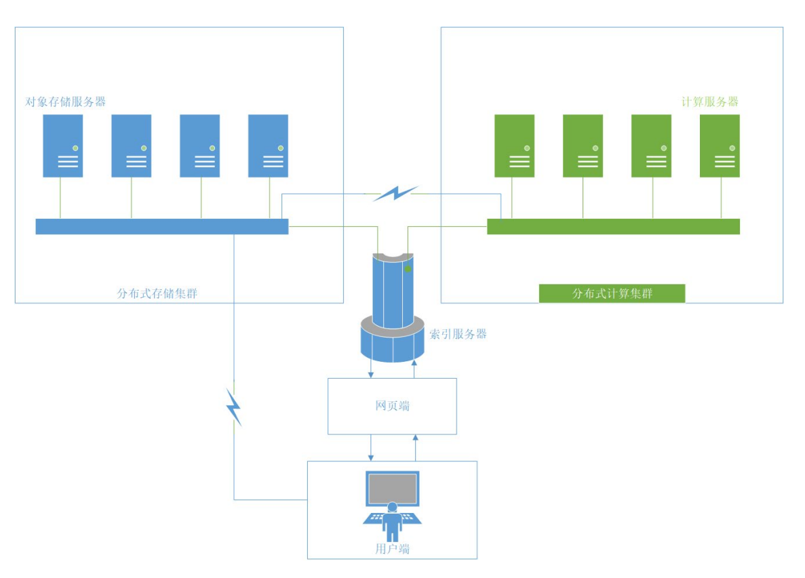
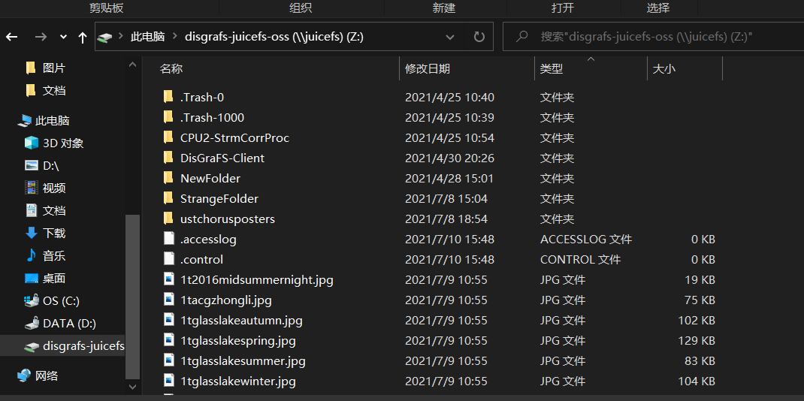
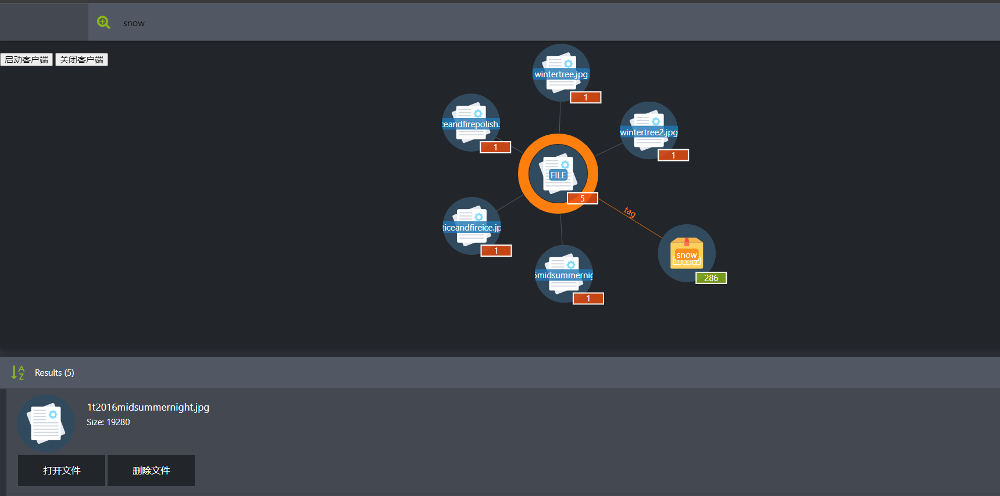

# 终期报告

## 项目介绍

在信息大爆炸的时代，人类所能够获取和存储的信息量不断增长，这对人类自身对大量信息的管理能力了更高的要求。但是，现有的基于树形结构的文件系统设计主要面向机器思维而非人类思维，这迫使人类不得不以机器的方式思考，试图将自己思维映射到树形结构上从而适应机器，从而导致人类不能按照自然的思维模式对存储的信息进行检索。在这种思维的扭曲下，分类困难、文件起名困难、找不到文件等令人头疼的问题便层出不穷。

 考虑到人类的思维很大程度上基于信息与信息之间的“相关性”，用图的结构来描述文件之间的关系显然比树形结构更加符合人类思维。现有的图文件系统、图数据库文件系统等技术，都是对这种新思路的探索。典型的图文件系统采用算法自动对各种文件进行标记，通过寻找共同的标记进行建图，并且在图数据库中对图进行维护。这些项目说明了图文件系统技术的可行性与各种理论上优点，但是仍然不够成熟。它们目前仅仅持在单机上运行，一方面，由同一台机器完成存储、标记、索引等所有工作，容易造成资源的紧张；另一方面，单机信息规模的索引仍在人的记忆能力之内，对图文件系统的需求不突出。这几方面的原因导致图文件系统并未能够投入实用。

 由此，我们提出构建分布式图文件系统（DisGraFS, Distributed Graph Filesystem）。在分布式机群的规模上，图文件系统能够实现所管理的信息规模的扩大与各类资源的均衡分配，从而在超出人类记忆能力的信息规模上体现出图文件系统相对于传统树形结构的优越性。通过主机（Master）对从机（Slave）的存储空间以及算力的合理调度以及在主机的指导下用户与从机之间的直接对接，我们的项目期望实现一个高效的、用户友好的、高可扩展性的分布式图文件系统，以进一步拓展图文件系统在未来应用中的可能性。

## 小组成员以及分工

- 彭怡腾（组长）：网页前端、索引服务器；
- 彭浩然：各平台客户端；
- 黄晋超：分布式计算集群；
- 朱一鸣：图数据库交互；
- 袁玉润：不同类型文件打标的实现；

## 立项依据

### 分布式存储与JuiceFS

相较于传统的单机存储，跨平台分布式系统的优点是：方便用户对存储空间的扩展，在目前个人持有设备数持续增加的时代，方便用户对于已有的设备上的文件进行更便捷的管理，以及对于为了可能持有的设备做出灵活的扩展。而相较于传统的树状检索，图检索更符合人类的使用习惯，尤其是在海量文件分布式存储的环境下，能为用户在检索文件的过程中节约大量时间。

JuiceFS 是一款面向云环境设计的高性能共享文件系统，在 AGPL v3.0 开源协议下发布。提供完备的 POSIX 兼容性，可将海量低价的云存储作为本地磁盘使用，亦可同时被多台主机同时挂载读写。使用 JuiceFS 存储数据，数据本身会被持久化在对象存储（例如，Amazon S3），而数据所对应的元数据可以根据场景需要被持久化在 Redis、MySQL、SQLite 等多种数据库中。

### 分布式计算与Ray

随着计算技术的发展，有些应用需要非常巨大的计算能力才能完成，如果采用集中式计算，需要耗费相当长的时间来完成。分布式计算将该应用分解成许多小的部分，分配给多台计算机进行处理。这样可以节约整体计算时间，大大提高计算效率。

Ray 是一款开源于2017年的分布式高性能计算引擎。Ray 的结构由两部分组成：application 层和 system 层 Application 层实现 API 和计算模型，执行分布式计算任务。System 层负责任务调度和数据管理，来满足表现性能和容错的要求。我们使用 Ray 来搭建分布式计算集群。

### 图数据库与Neo4j

图数据库（graph database）是一个使用图结构进行查询的数据库，它使用节点、边和属性来表示和存储数据。该系统的关键概念是图，它直接将存储中的数据项，与数据节点和节点间表示关系的边的集合相关联。这些关系允许直接将存储区中的数据链接在一起，并且在许多情况下，可以通过一个操作进行检索。图数据库将数据之间的关系作为优先级。查询图数据库中的关系很快，因为它们永久存储在数据库本身中。可以使用图数据库直观地显示关系，使其对于高度互连的数据非常有效。

Neo4j 是一个高性能的 NOSQL 图形数据库，它将结构化数据存储在图上而不是表中。它是一个嵌入式的、基于磁盘的、具备完全的事务特性的 Java 持久化高性能引擎，该引擎具有成熟数据库的所有特性。使用 Cypher 查询语言，将其用于表达性和高效的查询更新和图管理。Neo4j基于其特殊的储存结构与Cypher 查询语言，设计并优化了多种图上的算法，使得查询、插入、删除等图操作的效率大大提高。我们使用 neo4j 来进行对图数据库的管理，根据标签与结点的相邻关系来进行检索，充分发挥图数据库的优势，提升文件索引的效率。

### 从机打标应用的技术

- **pke**

  pke是一个基于python的文本关键词提取工具包。 它提供了一个端到端的关键短语提取管道，其中的每个组件都可以轻松修改或扩展以开发新模型。 我们使用 pke 进行文本文件（.txt, .pdf）的打标。

- **imagga**

  Imagga 图像自动标记技术可将相关标记或关键字自动分配给大量图像。 图像标记深度学习模型是 Imagga 计算机视觉产品的核心功能，它可以分析视觉图像的像素内容，提取其特征并检测感兴趣的物体。 我们使用 imagga 进行对图片文件的打标。

- **speech-to-text-wavenet**

  speech-to-text-wavenet是一项语音转文本技术。它基于DeepMind的WaveNet，是原始音频生成模型的语音识别张量流实现。经过初始训练后，即可实现语音转文本的功能。我们使用其进行对音频文件的打标。

- **metadata_extractor**

  元数据提取器是一个Java库，用于从媒体文件中读取元数据，来完成对视频文件的打标。

## 技术路线

### 系统架构

DisGraFS分为5个组成部分：索引服务器、分布式存储集群、分布式计算集群、网页端和客户端。

- **索引服务器**：进行分布式存储集群与分布式计算集群的通信、网页端部署的位置，目前也负责构建与维护图数据库（但若有需要，也可将图数据库的部分分离出去）；
- **分布式存储集群**：基于 Juicefs 的分布式储存系统，管理、存储和调度分布式存储系统中的所有文件；
- **分布式计算集群**：基于 Ray 的分布式计算系统，将文本语义识别、图像识别、语音识别以及元数据提取等任务分散给计算集群中的多个计算机；
- **网页端**：直观显示文件所构成的图，并将用户在图上的操作以友好方式展示。
- **客户端**：客户端负责直接接收用户对文件系统的操作，并针对不同的平台对其进行实现。

### 操作实现

一个完整的文件系统需支持新增文件、文件搜索、获取文件和删除文件的操作。

下面分别介绍这些操作在DisGraFS上的实现流程。

#### 新增文件

1. 用户在网页端启动客户端，将分布式存储集群挂载在本地电脑上；
2. 用户将需要上传的文件直接拖入 JuiceFS 对应的盘，此时分布式存储系统对文件进行切分并通过合理调度将文件分布式地存储在存储集群中；
3. 分布式存储集群发信息给索引服务器，索引服务器将信息转发给分布式计算集群，开始对文件进行内容识别并且打出标签；
4. 打标完成后，分布式计算集群将标签以及文件其他信息一起发送返回给索引服务器，索引服务器根据收到的标签以及文件信息更新图数据库。

#### 文件搜索

1. 用户在网页端提出文件搜索请求，网页端将搜索关键字（可以是标签，也可以是文件名）上传至索引服务器；
2. 索引服务器根据关键字创建搜索语句，在图数据库中搜索，将具有相关标签的所有文件通过图和列表两种方式返回至网页端；
3. 用户可以根据网页端返回的图，直接通过点击获得某一文件的标签与信息，或者获得具有某一标签的所有文件，实现根据文件内容进行搜索以及在图上直接搜索邻顶的目标。

#### 文件获取

1. 用户在关键词搜索返回的文件中找到自己需要的文件，点击打开文件的按键，服务器将消息传给 JuiceFS 分布式存储集群；
2. 分布式存储集群找到需要打开的文件，将其下载到用户本地存储空间并将其打开。

#### 删除文件

1. 用户在客户端提出删除文件的请求，客户端将目标文件名上传至索引服务器；
2. 索引服务器将信息传递给分布式存储集群，分布式存储集群将文件删除；
3. 索引服务器根据文件名删除图数据库中对应的节点，更新图数据库。

## 简单的效果展示

打开网页端后启动客户端，分布式存储集群挂载到本地：

文件搜索与打开、删除操作栏

