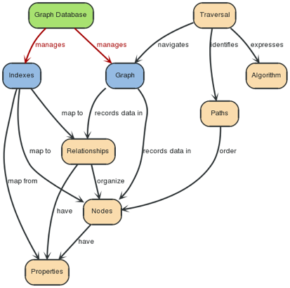
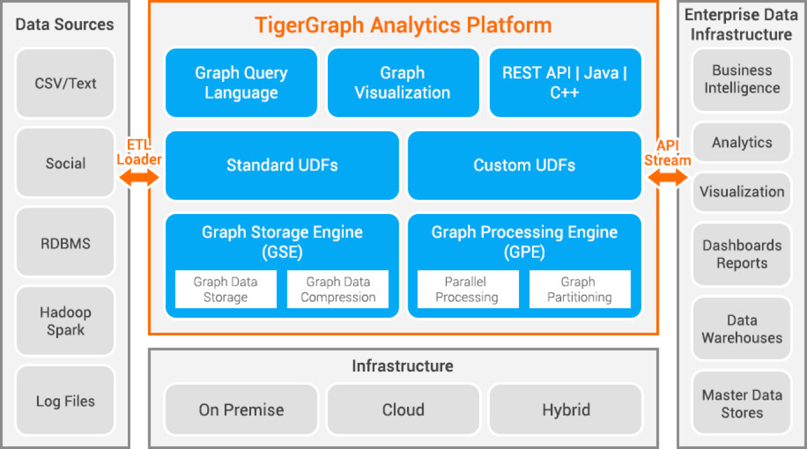
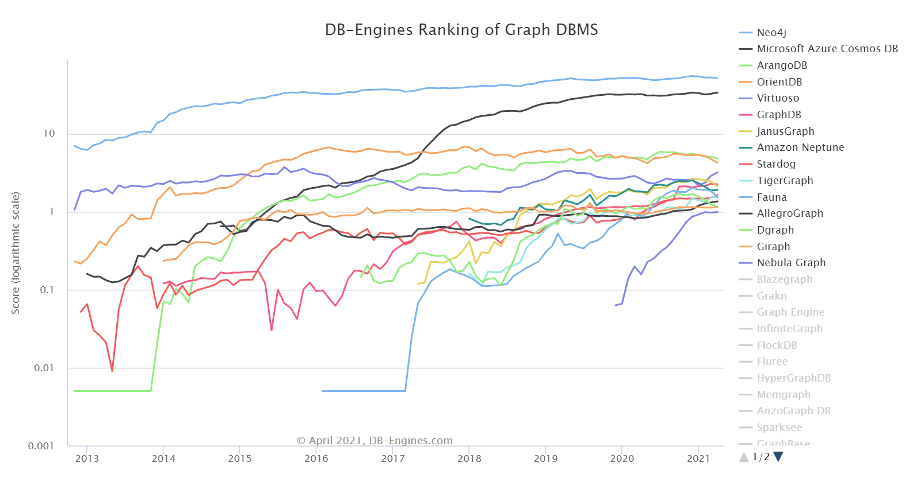
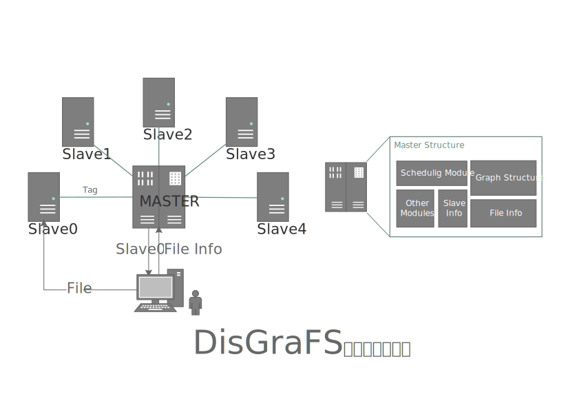

# 调研报告

## 小组成员

彭怡腾 彭浩然 朱一鸣 黄晋超 袁玉润

## 目录

- [调研报告](#调研报告)
  - [小组成员](#小组成员)
  - [目录](#目录)
  - [项目概述](#项目概述)
  - [项目背景](#项目背景)
    - [文件系统](#文件系统)
      - [GFS](#gfs)
      - [HDFS](#hdfs)
      - [Ceph](#ceph)
      - [MooseFS](#moosefs)
    - [图数据库](#图数据库)
    - [图数据库的研究与发展](#图数据库的研究与发展)
      - [图数据库面临的问题](#图数据库面临的问题)
      - [图数据库的体系结构](#图数据库的体系结构)
      - [大图数据分布式管理框架](#大图数据分布式管理框架)
      - [几种主流的图数据库介绍](#几种主流的图数据库介绍)
      - [Neo4j](#neo4j)
      - [TigerGraph](#tigergraph)
      - [Azure Cosmos DB](#azure-cosmos-db)
      - [几种数据库的比较](#几种数据库的比较)
  - [立项依据](#立项依据)
  - [前瞻性/重要性分析](#前瞻性重要性分析)
    - [分布式文件系统人机交互的优化](#分布式文件系统人机交互的优化)
      - [当前分布式文件系统存在的问题](#当前分布式文件系统存在的问题)
      - [DisGraFS的改进](#disgrafs的改进)
    - [图文件系统应用规模的扩大](#图文件系统应用规模的扩大)
      - [当前图文件系统存在的问题](#当前图文件系统存在的问题)
        - [单机上图文件系统的优势不突出](#单机上图文件系统的优势不突出)
        - [算力、存储和网络资源得不到合理的分配](#算力存储和网络资源得不到合理的分配)
      - [DisGraFS的改进](#disgrafs的改进-1)
        - [多用户情境下图文件系统优势更加突出](#多用户情境下图文件系统优势更加突出)
        - [实现算力、存储和网络资源的合理的分配](#实现算力存储和网络资源的合理的分配)
        - [跨平台支持与高可扩展性](#跨平台支持与高可扩展性)
  - [相关工作](#相关工作)
    - [数据库文件系统](#数据库文件系统)
    - [基于语义的文件系统](#基于语义的文件系统)
    - [分布式文件系统](#分布式文件系统)
  - [参考文献](#参考文献)

## 项目概述

在信息大爆炸的时代，人类所能够获取和存储的信息量不断增长，这些信息一方面推动了数据驱动型算法的发展，另一方面也对人类自身对这些信息的理解和掌握提出了更高的要求。然而，一个人的记忆能力是十分有限的，相比于他在实际工作所需要接触到的数据量，他的脑容量充其量也只能充当Cache和索引的角色。借助计算机的文件系统，我们能够有效地扩展大脑的“外存”，从而掌控更多的数据。在这个过程中，我们的大脑依靠对某一份信息的“印象”，即其部分标志性的内容，对信息进行索引，并且手动在文件系统中进行查找。

但是，现有的文件系统大多是基于树形结构的，其设计主要面向机器而非用户，而人类的大脑结构决定了他对于某一信息的“印象”通常是零散的、非树形的，因而与现有的文件系统的思维模式产生了冲突。这种冲突的结果是，人类不得不以机器的方式思考，试图将自己思维映射到树形结构上从而适应机器，从而导致人类不能按照自然的思维模式对“外存”中的信息进行检索。在这种思维的扭曲下，分类困难、文件起名困难、找不到文件等令人头疼的问题便层出不穷。

现有的技术也确实在试图缓解这个问题，如Everything、Spotlight、Listary等索引工具都可以依据文件名帮助用户快速找到所需文件。但究其根本，其准确性仍旧完全依赖于用户所起的文件名，即用户为文件提取的“特征”，这些工具并没有解决机器思维与人类思维之间的冲突。

行有不得，反求诸己。试想一个人不会随时随地感到孤独，却每每在看到情侣时会容易联想到单身的自己，这其实是因为他在两件事上发现了一定的关联。由此可见，人类的思维结构事实上很大程度上基于“联想”，即信息与信息之间的“相关性”。要描述这种思维模式，最恰当的模型其实是图，而非树。如果将信息视作节点，那么两个节点就会由于具有共同的特征从而在图中存在一条边。在信息和关联、节点和边的编织下，人脑中呈现出的是一张信息网络。如果我们能以这样的方式管理文件，无疑可以使人类更自然地与“外存”交互，从而在有限的脑容量上提高工作效率。

现有的图文件系统、图数据库文件系统等技术，都是对这种新思路的探索。典型的图文件系统采用算法自动对各种文件进行标记，通过寻找共同的标记进行建图，并且在图数据库中对图进行维护。这些项目说明了图文件系统技术的可行性与各种优点，但是仍然不成熟，能够管理的规模较小，未能投入实用。然而，它的出现却证实了图文件系统是人机交互在未来的一个发展方向。

在这个趋势下，图文件系统的应用必然会走向大型化、团队化。如果说用户在管理GB级别的个人文件时尚可应对，那真正的难题是，当他与数十甚至上百人合作时，要如何共同管理TB乃至更大规模的、由不同人创建和分类的文件。在这种情形下，在个人规模时适用的很多管理方法将会失效。由于人的思维不同，不同人制定的文件名会变得难以检索，目录分类也因人而异。受限于人的脑容量，要对如此海量的信息做到“大致有印象”也变成了一件不可完成的任务。现有的技术无法适配的场景，便是图文件系统最为亟需的突破点。

由此，我们提出构建分布式图文件系统（DisGraFS, Distributed Graph Filesystem），来实现图文件系统在更大规模上的应用。通过主机（Master）对从机（Slave）的存储空间以及算力的合理调度以及在主机的指导下用户与从机之间的直接对接，我们的项目期望实现一个高效的、用户友好的、高可扩展性的分布式图文件系统，以进一步拓展图文件系统在未来应用中的可能性。

## 项目背景

### 文件系统

​		文件系统是操作系统用于明确磁盘或分区上的文件的方法和数据结构，是在磁盘上组织文件的方法，是操作系统中负责管理和存储文件信息的软件机构。它由三部分组成：与文件管理有关的软件、被管理的文件以及实施文件管理所需要的数据结构。从系统角度来看，文件系统是对文件存储器空间进行组织和分配，负责文件的存储并对存入的文件进行保护和检索的系统。具体地说，它负责为用户建立文件，存入、读出，修改、转储文件，控制文件的存取，当用户不再使用时撤销文件等。

​		一个分区或磁盘能作为文件系统使用前，需要初始化，并将记录数据结构写到磁盘上，这个过程就叫建立文件系统。目前主流的文件系统通常可以分为以下几类：磁盘文件系统，分布式文件系统，用户态文件系统，虚拟文件系统，以及数据库文件系统。下面对几个常见文件系统概念，其目前发展，以及它们在本项目中的意义做简要介绍。

​		磁盘文件系统指的是我们常听说的FAT，EXT，NTFS等格式的文件系统。它是本地主机中可以实际访问到的文件系统，是驻留在磁盘上的文件系统，本项目暂不对此部分进行修改操作，指使用各平台操作系统提供的文件监控接口进行文件夹的监控，因此不过多介绍。

​		数据库文件系统（DBFS） 是 Oracle 11gR2 中提供的能够在 Linux 操作系统中将 Oracle 数据库当成文件系统来使用的功能。在 DBFS 内部，文件是以 SecureFiles LOBs的形式存储在数据表中。上一届的GBDFS项目就是基于数据库文件系统DBFS，将数据库文件系统改进成为了图数据库文件系统。

​		用户态文件系统是指完全在用户态实现的文件系统，传统上操作系统在内核层面上对文件系统提供支持。而通常内核态的代码难以调试，生产效率较低。而在用户态实现文件系统能够大幅度提高生产率，简化了为操作系统提供新的文件系统的工作量，特别适用于各种虚拟文件系统和分布式文件系统，也适用于让我们建立我们自己的新的文件系统，即分布式图文件系统。

​		**FUSE**

​		FUSE[1]是一个实现在用户空间的文件系统框架，通过FUSE内核模块的支持，使用者只需要根据fuse提供的接口实现具体的文件操作就可以实现一个文件系统。 

​		**DOKAN**

​		Dokan Library 帮助程序员在windows系统下轻松建立用户级文件系统，不需要写设备驱动，与FUSE类似。

​		如果本项目最后希望能够通过使用用户态文件系统来提升一些效率，那么这两个框架将为我们项目的跨平台实现提供帮助

​		分布式文件系统（Distributed File System，以下简记为DFS）是指文件系统管理的物理存储资源不一定直接连接在本地节点上，而是通过计算机网络与节点相连，或是若干不同的逻辑磁盘分区或卷标组合在一起而形成的完整的有层次的文件系统。常见的DFS有，GFS，HDFS，MogileFS，Lustre，Ceph，MooseFS，FastFS等。以下对这些分布式文件系统中有特色，对本项目有所启发的做简要介绍。

#### 		GFS

​		GFS 是 HDFS 的前身，具有很好的可靠性。在设计思路上，GFS 设计思路与传统文件系统设计思路完全不同，其中有如下几个特点： 
（1）组件失效被认为是常态，而不是意外。在分布式环境下，机器硬件失效是常态，所以分
布式存储系统必须要有容忍硬件失效的机制来保证硬件的失效不会影响系统的正常运行。 
（2）系统专为大文件设计[2]： I/O 操作以及文件基本存储单位都是基于大文件考虑。
（3）系统对文件的修改操作主要是在文件末尾进行数据的追加，而不是覆盖原有数据。

​		其中系统对文件的修改操作是追加而不是覆盖这个思想可以应用于我们的文件系统上面。

#### 		HDFS

​		HDFS是基于GFS提出的一种文件系统，具有高度容错性[3]，适合部署在廉价的机器上。它的优点在于高容错性以及浏览器接口和java api。但它也有很明显的缺点，只支持块写入，不支持随机写，不支持大量小文件存储，数据冗余存储，造成空间浪费[4]。

​		但如果面对普通用户的话，通常我们存储的大多是一些不太大的文件，因此块写入加上多重冗余的方式将造成极大的空间浪费，并不可取，有必要对此做出改进。

#### 		Ceph

​		Ceph存储系统的设计目标是提供高性能、高可扩展性、高可用的分布式存储服务[5]。它采用RADOS(Reliable Autonomic Distributed Object Store)在动态变化和异构的存储设备集群上,提供了一种稳定、可扩展、高性能的单一逻辑对象存储接口和能够实现节点自适应和自管理的存储系统。数据的放置采取CRUSH算法,客户端根据算法确定对象的位置并直接访问存储节点,不需要访问元数据服务器。它的优点在于高性能以及集群的高可扩展性、统一存储、适用范围广、支持块，文件和对象存储，支持范围广，接口丰富，包含C，C++，Java，Python，Ruby，PHP等多种语言接口。但它的缺点也很明显，数据分布的均衡性一般，架构复杂，代码耦合度高，版本依赖度高，不同版本之间往往不兼容。

​		其中，我们可以借鉴的地方主要有它的对象式存储方式，即只将文件信息发送给主机，再又主机进行调度，而不需要将整个文件全部传给主机，占用资源的同时也浪费了时间。同时我们也发现了它的不足，一个致命的不足就是不同版本之间不兼容，尝试过去年的图文件系统的我们发现，高版本依赖性的代码往往会给用户带来不太好的体验，因此这也是我们的项目中需要避免的地方。

#### 		MooseFS

​		MooseFS是基于Linux内核的分布式文件系统，需要调用fuse，但似乎也可使用WSL，MooseFS的工作主要是  MooseFS  客户端对存储服务器文件的读写，MooseFS 前端与 master 服务器发送消息，请求当前待操作数据的存储位置等信息，得到完整信息以后再对该资源进行存取操作，在操作完成以后将数据的操作记录发送给 Master 服务器进行同步，meta 服务器在随后也将完成日志的备份工作。 

​		MooseFS使用用户态文件系统不仅是为了实现一种自定义的文件系统，而且也是为了提升效率，不过有的研究[6]也表明，使用用户态文件系统和直接使用内核态文件系统在读写大文件时，效率上的差别并不是很大。

​		除此以外还有lustre，fastDFS等分布式文件系统，但它们或与上述分布式文件系统有较多相似之处，或为上述分布式文件系统改造前的产品，故在此不作过多的赘述。

​		在对文件系统的调研中，我们发现现有的文件系统常为一种逻辑上的树形文件系统结构，通过严格的层级结构组织文件，来方便它们的检索。用户在搜索文件的时候，通常使用导航或是搜索来检索文件，但研究表明，用户很少（4%-15%）使用后一种方法[7]。因此导航成为了检索文件的主要机制，基于此，有人提出了语义文件系统（SFS）的概念。将标签等概念引入文件系统，以便于用户对文件的管理[8]。

​		麻省理工学院的SFS[9]被称为第一个SFS，它所采取的方式即是根据不同文件类型从文件中挖掘和索引属性，再将用户输入的路径映射到查询中，获得文件。这么做固然能够方便用户的使用，但是其本质上还是没有脱离层次结构。而360◦Semantic File System也只是将这个层次对用户隐藏了起来。

​		除此之外，上下文感知文件系统（CAFS）[10]也吸引了我们的注意，它通过时间和位置信息对用户进行动态感知，从而使用户在需要的时候自动获得需要的文件，例如当用户告知计算机下午三点有报告的时候，当他出现在演播厅，文件系统就会自动调出幻灯片的文件。这是一种交互式的文件系统，这种思想在360◦Semantic File System也有借鉴和使用，但是这种预判断方式的准确性，以及未命中后再次搜索的时效性依然是一个极大的问题。因此我们认为我们的目标并不是猜测用户何时需要何种文件，而是使他们更方便快速的获取他们所需要的文件。

### 图数据库

图数据库用图来存储数据，是最接近高性能的一种用于存储数据的数据结构方式之一。[11]

**图数据库**（graph database）是一个使用图结构进行查询的数据库，它使用节点、边和属性来表示和存储数据。该系统的关键概念是**图**，它直接将存储中的数据项，与数据**节点**和节点间表示关系的**边**的集合相关联。这些关系允许直接将存储区中的数据链接在一起，并且在许多情况下，可以通过一个操作进行检索。图数据库将数据之间的关系作为优先级。查询图数据库中的关系很快，因为它们永久存储在数据库本身中。可以使用图数据库直观地显示关系，使其对于高度互连的数据非常有用。

**节点**：构成一张图的基本元素是节点和关系，节点和关系都可以附带属性。

**关系**：通过关系可以找到很多关联的数据，比如节点集合，关系集合以及他们的属性集合。

**属性**：节点和关系都可以设置自己的属性。 属性是由Key-Value键值对组成，键名是字符串。

**路径**：路径由至少一个节点，通过各种关系连接组成，经常是作为一个查询或者遍历的结果。

**遍历**：遍历一张图就是按照一定的规则，跟随他们的关系，访问关联的的节点集合。

### 图数据库的研究与发展

#### 图数据库面临的问题

​		大图数据规模庞大，不仅仅包含大量图数据节点及其节点属性，而且包含图数据节点之间复杂的关联关系，使得图数据库操作代价高。随着图规模的增长，查找、删除、插入结点的代价急剧上升。此外，操作的复杂性基于单机内存环境。考虑到单机内存无法满足大图数据处理需求，大图数据操作还需要考虑磁盘访问代价和分布式环境中网络访问代价。[12]

​	大图数据表达灵活，不同类型节点结构异构，每个节点和边上属性模式信息各不相同，很难抽象出相对固定的模式。大图数据操作不仅仅局限于类似检索某个点的所有关联边这样简单的查询，而且还包括更加复杂的、侧重于全局的查询和分析，如图中最短路发现查询、最小支撑树构建查询、子图模式匹配等操作。考虑到大图数据操作的灵活性，很难抽取公共部分进行优化或者简化表达。

​		大图数据复杂性的特点使得很难直接应用并行计算模型解决大图数据操作。图数据规模庞大使得并行分布策略不可避免。同时，由于图数据内部关联灵活、复杂，图数据操作很可能需要全局的图数据信息。即使实现图数据的分块和并行操作，不同分块之间依然存在大量的访问，无法简单直接实施并行操作。[12]

#### 图数据库的体系结构

​		分布式大图数据管理是大图数据管理的主流结构。由于大图数据的规模庞大、节点信息丰富、计算代价高，利用多机的计算资源和存储资源管理大图是大图数据管理的趋势。在分布式大图数据管理中，目前应用比较广泛的是基于 Mapreduce和基于BSP计算模型的大图数据管理。基于 Mapreduce框架实现大图数据管理是可行的技术路线。 Mapreduce框架是目前通用大数据的并行处理框架，大图数据的查询可以通过 Mapreduce框架实现，具有良好的可扩展性和大数据分析的高吞吐量。但是，由于 Mapreduce框架处理大图数据导致过多的磁盘读写操作，基于 Mapreduce框架的大图数据管理效率不高。

​		基于BSP计算模型的大图数据管理方案具有较好的可扩展性和较高的效率。为了克服 Mapreduce管理大图导致的各类问题， Google借鉴BSP计算模型的思路，设计了Pregel框架。 Pregel框架将图数据存储在分布式环境中不同计算节点的内存中，支持以点为中心的计算模式，通过内存随机访问直接修改节点的状态，避免磁盘读写的/O代价。Google的 Pregel系统已经用于Web级别的大图节点重要性排序等操作，展示出较强的可扩展性。 Pregel在 Apache社区的开源版本Giraph在 Facebook也得到重要应用，在社区发现、子图聚类等操作上取得良好效果。

​		如今出现一种新兴的可视化的探索性的子图搜索框架，提出两个新颖的索引结构Vaccine和Advise，解决图形数据库的查找效率和子图搜索中的可伸缩性问题。Vaccine是离线、基于特征的索引，储存了子图中查找频率、子图之间的转换等丰富的信息；Advise是一个实例化的、自适应的、紧凑的动态索引，在子图的迭代可视化以及重构期间查询搜索记录并对其进行反复的评估。[13]

#### 大图数据分布式管理框架

​		Pregel[14]：Pregel是Google在2010年发表针对大图数据的分布式计算框架，是目前大图数据管理领域最有影响力的研究成果之一。针对 Mapreduce框架管理大图缺乏迭代支持、随机数据修改代价昂贵等问题， Pregel框架做了创新和优化。 Pregel将不同数据节点进行分割，分别加载到不同的计算节点中。图数据查询整体遵循BSP计算模型，每个图查询由多个超步加以完成。每个超步中，图数据节点计算采用以节点为中心的编程模型。 Pregel框架在 google得到广泛应用，支持Web级别的大图数据节点重要性排序等基本操作。

​		Giraph[15]: Giraph 是 Apache所支持的，它是一个在 Hadoop之上运行的 Pregel的开源系统。 Giraph 中实现了BSP的计算模型，支持用户以点为中心的脚本编程。相对于其他分布式图查询系统， Giraph 有一个显著特点，即 Giraph 本身是一个无 Reducer的 Mapreduce任务，图数据查询处理易于和 Hadoop环境进行集成。 Giraph 在 Facebook有重要的应用，支持社区发现、节点重要性排序等操作。

​		Trinity系统： 微软研究院设计了Trinity系统。该系统能够同时支持低延迟的在线查和高吞吐量的离线分析。为了避免外存随机扫描的影响， Trinity将图数据保存在内存云中，并且设计了复杂的内存机制来管理边长数据。 Trinity在上层引入了查询语言TQL表达图数据的查询。

​		Graphlab 和 PowerGraph[16]： Graphlab是一个支持异步执行方式、利用共享内存的大图数据管理框架。为了提高异步执行中的数据一致性， Graphlab引入了数据节点访问的锁机制。针对自然图中高度数节点带来的负载偏斜， Graphlab的后续版本 PowerGraph引入了边划分的策略，建立高度数节点的副本，划分关联边到不同的计算节点，使得每个算节点上拥有均衡数量的边，从而提高查询执行效率。

#### 几种主流的图数据库介绍

#### Neo4j

​		Neo4j[17]是一个高性能的NOSQL图形数据库，它将结构化数据存储在图上而不是表中。它是一个嵌入式的、基于磁盘的、具备完全的事务特性的Java持久化高性能引擎，该引擎具有成熟数据库的所有特性。

数据流架构：

使用查询语言cypher：

对比命令式语言如Java和脚本语言如Gremlin和JRuby，它的焦点在 于从图中如何找回，而不是怎么去做。这使得在不对用户公布的实现细节里关心的是怎么优化查询。

Cypher的语法提供了一种视觉和逻辑的方式来匹配图中节点和关系的模式。它是一种声明性的，基于 SQL的语言，用于使用ASCII-Art语法描述图形中的视觉模式。

主要优势：生态较为完整，提供多种API接口；层数较低时查找效率可观；使用量大，有较多资料和工具。

****劣势****：层数较多时查找较慢；非分布式储存。

#### TigerGraph

​		TigerGraph[18]是一款“实时原生并行图数据库”，既可以部署在云端也可以部署在本地，支持垂直扩展和水平扩展，可以对集群中的图数据自动分区，遵循ACID标准，并且提供了内置的数据压缩功能。它使用了一种消息传递架构，这种架构具备了可随数据增长而伸缩的并行性。

架构：

使用新的查询语言GSQL，有以下特点：

​		多部路径遍历：GSQL 支持分析规范，这些分析涉及在图中遍历多步路径，同时沿着路径传播计算出的中间结果。

​		假定预定义模式：GSQL 假定一个预定义模式，并将其作为元数据存储在数据库目录中。这可提高存储和访问效率，因为模式元数据可从点/边/属性表示中分解出来。这使性能得以提高，不仅因为节省了空间，还因为在预先更深入了解数据模型后，可进一步优化查询：更多筛选、更好的排序、更多捷径等。

主要优势：查询效率最高（在多层查找和数据量庞大时优势明显），分布式储存。

缺陷：图创建好后只能手动在现有图上进行增添或删去；GSQL语法规则复杂，学习成本高；Tigergraph生态不是很全，编程API接口有一定的限制。

#### Azure Cosmos DB

​		Azure Cosmos DB 是一种用于新式应用开发的完全托管的 NoSQL 数据库。 在高吞吐量、大规模的数据集上的表现良好。作为一项完全托管的服务，Azure Cosmos DB 使用自动管理、更新和修补，使你无需进行数据库管理。 它还通过经济高效的无服务器和自动缩放选项处理容量管理，这些选项可响应应用程序的需求，使容量与需求相匹配。

使用Gremlin语言。

优势：支持多个平台；模拟器在本地可完成大部分任务；使用开源 API、多个 SDK、无架构数据和对操作数据的无 ETL 分析进行快速构建；除了图之外还有多种储存模式。

劣势：图的可视化需要集成Linkurious Enterprise；使用云服务需要用visa信用卡进行注册。

**其他**

Hugegraph：原生的可视化工具，**一键部署**，支持多图管理、图查询、数据导入、schema复用。

ArangoDB：插入新节点时算力消耗较大但查找和索引较快；用内存换取效率；支持的操作系统多。

#### 几种数据库的比较

**主要特性对比**

| 图数据库          | Neo4j                                                        | Azure Cosmos DB                                              | TigerGraph                                                   | JanusGraph                                                   |
| ----------------- | ------------------------------------------------------------ | ------------------------------------------------------------ | ------------------------------------------------------------ | ------------------------------------------------------------ |
| 描述              | 开源图数据库                                                 | 全球分布式、水平可拓展、多模型数据库服务                     | 支持实时网络规模数据分析的完整、分布式、并行图形计算平台     | 分布式集群优化的图形数据库                                   |
| 服务器操作系统    | Linux Solaris Windows                                | 仅基于云端                                                   | Linux                                                        | Linux Windows OS X                                   |
| 使用许可          | 社区版开源                                                   | 免费用户享受5G以内的数据服务（需要visa行用卡进行认证）；提供仅限于本地的模拟器 | 容量小于50G、社区支持的免费许可证；原厂支持、容量大的企业版需付费以获得许可 | 完全开源                                                     |
| 实现语言          | Java   Scala                                                 |                                                              | C++                                                          | Java                                                         |
| API和其他访问方法 | Bolt protocol; **Cypher query language;** Java API; Neo4j-OGM; RESTful HTTP API; Spring Data Neo4j; TinkerPop 3 | DocumentDB API; **Graph API (Gremlin);** MongoDB API; RESTful HTTP API; Table API | **GSQL (TigerGraph Query Language);** Kafka; RESTful HTTP/JSON API | Java API; TinkerPop Blueprints; TinkerPop Frames; TinkerPop Gremlin; TinkerPop Rexster |
| 技术文档          | https://neo4j.com/docs/                                      | https://docs.microsoft.com/azure/cosmos-db/                  | https://docs.tigergraph.com/                                 | [docs.janusgraph.org](https://docs.janusgraph.org/)          |
| 安装              | 在Linux上安装对安装环境有依赖；支持多个平台使用              | 本地模拟器安装和使用较为方便；使用云服务器需要用visa注册Azure账号 | 仅在linux上运行，对安装环境有依赖                            | 提供Docker image（使在单台机器上运行服务器和客户端变得更加容易，而无需处理多个安装） |

**目前各大图数据库使用趋势[19]**

## 立项依据

​		如前所言，当前主流的分布式文件系统有着不少的优点值得我们学习，如GFS对文件的修改采用增量式，HDFS的高容错性，Ceph的对象式存储方式等等，这些都是我们可以在项目中借鉴的思想。但同时我们也应该看到它们有着一些不足的地方，这些分布式文件系统大多只关注了文件的海量存储特性，无法忽视的是，用户查询搜索文件的效率将随着文件量级的上升而急速降低，尤其是在一些数据中心等应用场景，海量文件的低效率查询方式将浪费大量的计算机资源以及时间资源，因此我们需要一种用户友好型，便于分布式文件系统的用户方便快捷的搜索自己所需文件的一种方式。

​		已有的一些语义文件系统，只关注于文件的自然属性本身，却仍未脱离出树型层状的传统文件系统的概念，使得其难以达到预想的方便用户的效果。不难想到，当我们以往一个文件的位置时，可能也连其自然属性也难以记忆深刻，这时候纯粹依据机器对文件本身自然属性的识别来帮助用户查找文件并非是一个好的选择。可能用户只是模糊的记得某一个属性，抑或是只记得存入改文件时与其一同存入的文件的属性，只依赖于机器标签的搜索方式可能会使得用户的搜索词与实际标签擦肩而过，又由于文件系统本身的树状结构，导致未命中时再搜索的成本与以往的传统文件系统并无差异，因此，在树状文件系统上设立标签并不是一个最佳的方法。		

​		于是我们想到了将标签与图结构联系起来，往届也有过类似的项目，但往届的图数据库文件系统，只着眼于单机文件所建立其的图结构，使用机器打标，隔离了用户对图节点，即文件属性的修改操作。这一操作杜绝了不同用户对于同一文件的主观理解性，从长远来看，由于人类自身记忆的不可靠，或许隔离用户打标是一个好的选择，但我们认为如果是一个基于单机文件系统，用户完全遗忘自己欲搜索文件的关键词的可能性并不大，相反，如果是多用户操作的分布式文件系统，由于用户不同，导致的主观性命名不同，使得不同用户在搜索同一文件时，可能会想到截然不同的关键词，因此在这种应用场景下，迫切的需要一种统一的文件标签模式，方便不同用户对于同一文件的搜索查询，也正是在这种应用场景下，机器打标的图文件系统的优势才能更加淋漓尽致的发挥出来。同时，虽然往届项目依托于浏览器搭建，但其本身内部调用了大量Linux操作系统独有的功能，失去了使用浏览器作为UI，方便跨平台使用的良好特性，因而在跨平台方面仍有大量的改进空间。

​		DisGraFS为改善上述问题，提出了分布式图文件系统的概念，统一了单机图文件系统和分布式文件系统的优点。将图结构与思想应用于分布式文件系统上面，使得分布式图文件系统兼具图文件系统方便用户快速搜索，模糊搜索，查找相关文件的特点以及分布式文件系统的海量文件存储，云存储的特点。同时吸取前人的经验，整个项目开发过程均会使用便于跨平台的语言和属性，以满足当今以及未来社会对于多设备，多平台的大容量，快搜索的文件系统的需求。

​		DisGraFS的初步架构如下图所示，首先将依托于一台主机与用户使用网页端进行交互，通过浏览器本身的特性调用操作系统文件管理器，对用户文件进行分析，利用FTP传递信息至主服务器。再由主机对文件信息分析，对从机空间进行调度之后，返回给用户本次传输的从机IP地址，用户的文件将由此传输到指定的从机服务器上。最后，从机发送收到指令以及文件标签给主机，主机对图结构做出更新，等待下一次用户的操作。

## 前瞻性/重要性分析

### 分布式文件系统人机交互的优化

#### 当前分布式文件系统存在的问题

从项目背景的调研中可以看出，现有的分布式文件系统的优化方向主要都是针对大规模的数据、大文件、高可用性、高容错性和高效率等机器指标，其出发点大致都是在单机的存储容量和性能无法进一步提升的前提下，如何整合更多计算资源，以放大单机上的存储模式，从而达到组成数据中心等的目的。在这种分布式文件系统中，能直接索引、访问、操作如此大规模数据的通常是机器，而人类用户常常需要透过层层接口、经过程序对数据的组合、处理，才能在如此海量的数据中找到有用的部分。因此可以说，现有的分布式文件系统基本都是面向机器的存储需求设计的，而在这种传统的存储结构下，人类用户在如此规模的数据面前是完全没有使用的能力的。即使是在个人电脑规模的数据下，也极少有用户对文件进行了有效的索引或搜索[7]，而当用户需要处理更大规模的数据时，在缺乏有效的符合人类思维的索引方法的现有分布式文件系统下，其使用体验是十分差的。

#### DisGraFS的改进

在数据规模不断增大的情况下，依靠分布式系统提供更高的存储能力是无可避免的途径。在这个过程中，对用户本就不够友好的文件系统等比例放大，会使得这个矛盾更加突出。因此，将图文件系统引入分布式文件系统，使分布式文件系统从内部实现上支持符合人类思维方式的索引方式，可以避免使用难度随数据规模增长而增长，从而在已有的分布式技术和大型机群的条件下，能维持文件系统对人类用户的可用性。

随着人类掌握的信息量的不断提升以及大规模系统中不同用户共享数据需求的提升，如何有效地管理海量数据并在更大的规模下保持乃至提升人机交互体验，是当今大数据时代对计算机系统提出的新的课题。人类的工作离不开计算机的算力与存储，而计算机的发展也离不开人类的思维，但当两种不同思维相冲突时，人机交互的有效性将会成为人类所掌控的信息量进一步扩大的瓶颈。分布式图文件系统希望能够突破这个瓶颈，为大数据时代的进一步发展提供稳固的基础设施。

### 图文件系统应用规模的扩大

#### 当前图文件系统存在的问题

##### 单机上图文件系统的优势不突出

图文件系统旨在克服传统文件系统针对机器设计的结构，消除由于这种结构而产生的矛盾，但是，在单机场景下，文件规模不至于很大，即使仅仅使用传统的文件系统，在索引工具的帮助下，同时凭借用户自己日常对于文件的维护和整理，用户对文件查找的效率也还处于可接受的程度。因此，即使现在已经存在一些图文件系统的富有远见的构想，在其他传统索引工具的替代下，其优势受限于算力的使用、索引的复杂程度，也仅仅能得到有限的展现，因而在实际使用中并不常见。

##### 算力、存储和网络资源得不到合理的分配

目前已知的图文件系统的结构都大体类似，使用识别算法对不同类型的文件进行关键词提取，再依据关键字建立图数据库，通过对数据库的索引来查找本机的文件。与其他文件系统和索引系统不同的一点是，图文件系统中存在提取文件内容关键词的这一步骤。因此，除了常规文件系统所需要的存储资源和传输资源外，图文件系统还对算力有一定的要求。在单机情景下，文件和数据库的维护任务以及关键词提取的任务都由本机完成，多方面的资源全部要求同一台机器提供，各种资源无法得到合理分配。

#### DisGraFS的改进

##### 多用户情境下图文件系统优势更加突出

在多用户、团队协作等情境下，每个用户对自己文件的整理方式不同、命名不同，一个成员通常更难以对所有文件有像单机情境下的查找能力。这时在单机情境下替代图文件系统的各种工具，由于失去了其所依赖的用户对文件名手动标记的印象，在多用户场景下会趋于失效。与之形成对比的是，图文件系统不依赖于用户对文件进行的归类，其关键词仅仅取决于文件的内容，这时，用户不需要了解其他用户的命名习惯就可以在一个自己并不熟悉的大规模文件系统下快速检索到自己所寻找的文件。在传统索引方式失效的情况下，分布式图文件系统真正地将图文件系统的应用规模推进到了其优势能更加明显的层面，从而进一步挖掘了图文件系统的实用价值。

##### 实现算力、存储和网络资源的合理的分配

分布式图文件系统中，文件、数据库的维护任务以及关键词提取的任务可以不再集中于一台机器，而是分配到不同的设备上完成。例如，主机负责图的维护、从机的调度以及和用户的直接交互，对算力和存储的要求不大，但对网络的要求较高；从机主要负责文件的存储和关键内容提取，对算力和存储要求较高。各个设备可能有不同的算力、存储空间和网络带宽，而在图文件系统对三者皆有要求的情况下，可以通过对机器角色的合理分配以及主机对从机的合理调度，实现算力、存储和网络资源的合理分配，最大化地利用资源。

##### 跨平台支持与高可扩展性

通过使用多平台支持的技术，分布式图文件系统可以做到对设备（主机、从机）平台要求的最小化和对用户环境要求的最小化。用户无需在本地安装任何软件即可通过网页访问系统，确保了系统对各种平台用户的可用性。主机和从机环境配置方便，服务端使用的技术不依赖于特定平台，高可扩展性可以使更多边缘资源易于整合入系统，为系统在未来将会面临的大规模、复杂应用场景扫清障碍。

## 相关工作

### 数据库文件系统

​		不同于一般的基于层次结构的文件系统，数据库文件系统按照文件的特性对其进行管理，如主题、作者及其元数据信息。

**sf.net**

​		DBFS最先由University of Twente的Onne Gorter进行开发，现已成为sf.net[10]项目。如今KDE的core中已经加入了DBFS，打开文件和保存文件界面已经被DBFS替代，然而其底层始终是传统的层次化文件系统，只是向用户呈现出了DBFS的表象。

​		sf.net的这个项目最开始是为了实现使用户能够通过文件的各种特征来找到文件的便捷性。例如，当用户需要找到一个文件，那么这个DBFS将向用户收集该文件的信息，其中包括但不限于：这个文件上个月被编辑过吗？这个文件是否是一个文字文档？这个文件是否属于某个特定的项目？有了这样一些问题，DBFS的搜索范围逐渐减小，最终确定在一些文件上，甚至能直接定位到用户想要的文件。

​		相较于传统的文件系统使用的目录结构，DBFS中更多地使用关键词。并且在DBFS中，这样的一些关键词更像是目录的超集。

​		此外, sf.net项目中的DBFS还有几个比较重要的设计。首先是，DBFS不存储系统文件，也就是它不存储libraries，或字体文件等。主要原因是这些都不是文档，不是日常生活中会去查找的，也不太方便在DBFS中存储。其次，一些应该在一起的文件，应该视为一个文档。举例来说，一个音乐文件，它的对应的歌词文件应该和这个音乐文件绑定在一起作为一个文档；或者一部电影有两个部分，这两个部分虽然是两个文件，但在DBFS中也应该被视为一个文档。

有许多项目[20]并非纯粹的数据库文件系统，但他们用到了数据库文件系统的一些方面：

1. Web content management system

   许多web内容管理系统使用relational DBMS来存储和检索文件。例如，SQL SELECT 语句检索文件允许使用复杂的逻辑及比普通的文件系统更丰富的信息进行关联。

2. 一些超大型文件系统如Apache Hadoop, Google File System同样使用了数据库文件系统中的概念。

### 基于语义的文件系统

**Semantic File System**

​		Semantic File System 根据数据的语义及用途来组织文件，而非传统的文件地址。它允许通过文件内容来查询文件。传统的层级文件系统给用户维护文件带来巨大的负担。Semantic File System通过文件标签减轻了用户负担并提供了一种符合直觉的文件搜索方式[21]。

​		语义文件系统遇到的一大难题便是给文件提供适当的语义标签。并且，为维护标签的有效性，在文件被修改后文件系统需及时更新、建立或删除标签。

**TagFS**

​		为解决传统的层级文件系统无法帮助人们组织文件的问题，TagFS允许用户自行添加标签，并对标签进行语义上的搜索。在文章中，作者分析了严格层级结构的文件系统和基于标签的文件组织方式之间的语义区别。基于以上调查，作者将无分级的标签系统与语义查询映射到常用 的层级文件系统，结合了二者的优势[22]。

**Graph File System**

​		University of Pisa的Daniele Di Sarli建立了一种图文件系统(GFS)[23]。主要的思想是将基于路径的层级定位代替以语义。换句话说，路径不再被视为目录有序列表，而是被视为一个集合。这样一来，要取得一个文件，就不再需要记住属性顺序。此外，它也改进了SIL(Semantic instead of Location)需要得到所有tags才能找到一个文件的缺陷。

​		而这个GFS设计中，作者认为并不能完全抛弃系统文件夹这样的传统特性。此外，为了减轻用户手工标记的工作量，文件系统必须提供分配多个标记以及同时标记多个文件的自然方法。GFS可以看作是一个标准的文件系统，在其任何一个位置，用户都可以创建标准目录(standard directory)或者语义目录(semantic directory)。标准目录有自己的名称空间，并且与传统的文件系统相同，其行为与其直接祖先(direct ancestor)的类型无关；语义目录以一个标准目录作为其直接祖先，并在此目录中定义了新的语义空间(semantic space)。此外，每个语义子目录均定义了一个标签。

​		最关键的地方是语义目录的管理方式：语义空间可以建模为一个直接连接的Ego Graph，其中入口点是中心，标签是其他节点。一旦创建了一个新标记，就创建了从入口点到入口点的两条边。此外，新标记与路径中到入口点的所有标记进行双重链接。在语义空间中创建标准目录将导致退出此空间。这使语义空间与标准层次结构交替成为可能。这种机制的一个使用示例可能是这样的情况:用户希望自己的主目录是语义目录，但他们也希望音乐有一个单独的名称空间，工作文档有一个名称空间，日志文件和下载有一个标准行为。

### 分布式文件系统

**Hadoop distributed file system**

​		在Hadoop分布式文件系统（HDFS）[24]是一个分布式，可扩展和可移植的文件系统用Java编写的Hadoop框架。其拥有以下5个服务，其中前3个为Master services，后2个为slave services：

1. Name Node

   HDFS仅包含一个称为“主节点”的名称节点。主节点可以跟踪文件，管理文件系统，并在其中具有所有已存储数据的元数据。特别是，名称节点包含块数，存储数据的数据节点的位置，复制的存储位置以及其他详细信息的详细信息。名称节点直接与客户端联系。

2. Secondary Name Node

   这仅是为了照顾Name Node中文件系统元数据的检查点。

3. Job Tracker

   接受来自客户端的Map Reduce请求，并与Name Node沟通以获知数据具体存储位置。

4. Data Node

   数据节点将数据作为块存储在其中。它将实际数据存储到HDFS中，HDFS负责客户端读取和写入。每个Data Node每3秒向“Name Node发送一个Heartbeat消息，并传达该消息处于活动状态。这样，当Name Node在2分钟内未从数据节点接收到心跳时，它将将该数据节点视为已失效，并开始在其他某个Data Node上进行块复制的过程。

5. Task Tracker

   Job Tracker的从节点，从Job Tracker接受任务。

   HDFS将大型文件分布地存储在多个机器，并通过复制数据来实现可靠性的要求，理论上无需主机上的RAID存储。

HDFS对大量小文件的处理效率很低，对此有许多提出解决的办法[25] [26]。

## 参考文献

[1]GCRFP Cache Algorithm Simulation using User Space Filesystem 2020 3rd International Conference on Information and Communication Technology(ICIACT) Wahyu Suadi Supeno Djanali Waskitho Wibisono 2020

[2]Formalizing Google File System  Mengdi Wang, Bo Li, Yongxin Zhao and Geguang Pu Shanghai Key Lab of Trustworthy Computing, Software Engineering Institute 2014

[3]Hadoop Distributed File System Security  – A Review Proceeding of 2018 IEEE International Conference on Current Trends toward Converging Technologies, Coimbatore, India S. Suganya  Department of Computer Science and Engineering,  Anna University, Chennai,  TamilNadu, India 2018

[4]Research and Implementation of HDFS File  System Upgrade Scheme Master's thesis of Nanjing University of Posts and Telecommunications WangLei 2020

[5]An improved small file storage strategy in Ceph File System 2018 14th International Conference on Computational Intelligence and Security (CIS)  Ya Fan , Yong Wang, Miao Ye School of Computer Science and Information Security, Guilin University of Electronic Technology, Guangxi, P.R. China 2018

[6]Research on Sharing Access and Performance Improvement Based on User-Space File System YANG Hongzhang YANG Yahui SUN Guangyu School of Software & Microelectronics, Peking University School of Electronics Engineering and Computer Science, Peking University 2020

[7]360◦Semantic File System Augmented DirectoryNavigation for Nonhierarchical Retrieval of Files IEEE Access SYED RAHMAN MASHWANI SHAH KHUSRO 2018

[8]TreeTags: Bringing Tags to the Hierarchical File System Nehad Albadri Richard Watson Stijn Dekeyser 

[9]D. K. Gifford, P. Jouvelot, M. A. Sheldon, and J. W. O. James, ‘‘Toole,‘‘Semantic file systems,’’ presented at the 13th ACM Symp. Oper. Syst. Princ., Pacific Grove, CA, USA, 1991

[10]Database File System. In DBFS.http://dbfs.sourceforge.net

[11]"Graph Database Architecture and Use Cases", Website, 2019.https://www.xenonstack.com/insights/graph-database/

[12]Verma, Shiv, " An experimental comparison of partitioning strategies in distributed graph processing", 2017https://www.ideals.illinois.edu/handle/2142/97724

[13]Chaohui Wang, Miao Xie, Sourav S. Bhowmick, Byron Choi, Xiaokui Xiao, Shuigeng Zhou, "FERRARI: An Efficient Framework for Visual Exploratory Subgraph Search in Graph Databases", 2020

[14]Grzegorz Malewicz, Matthew H. Austern, James C. Dehnert, Ilan Horn, Naty Leiser, Grzegorz Czajkowsk,"Pregel: a system for large-scale graph processing" ,Proceedings of the 2010 ACM SIGMOD International Conference on Management of data, June 2010

[15] Minyang Han, Khuzaima Daudjee, "Giraph unchained: barrierless asynchronous parallel execution in pregel-like graph processing systems", 2015

[16]M Han, K Daudjee"Giraph unchained: Barrierless asynchronous parallel execution in pregel-like graph processing systems", 2015

[17]neo4j documentationhttp://neo4j.com.cn/public/docs/index.html 

[18]tigergraphhttps://docs.tigergraph.com/

[19]DB ENGINEhttps://db-engines.com/en/ranking/graph+dbms

[20]Database file systems. In Wikipedia. https://en.wikipedia.org/wiki/File_system#Database_file_systems

[21]S. R. Mashwani and S. Khusro, "360° Semantic File System: Augmented Directory Navigation for Nonhierarchical Retrieval of Files," in IEEE Access, vol. 7, pp. 9406-9418, 2019, doi: 10.1109/ACCESS.2018.2890165.

[22]Bloehdorn, S., Görlitz, O., Schenk, S., & Völkel, M. (2006). TagFS - Tag Semantics for Hierarchical File Systems.

[23]Daniele Di Sarli, Filippo Geraci.GFS: a Graph-based File System Enhanced with Semantic Features

[24]Evans, Chris (October 2013). "Big data storage: Hadoop storage basics". computerweekly.com. Computer Weekly. Retrieved 21 June 2016. HDFS is not a file system in the traditional sense and isn't usually directly mounted for a user to view

[25]Mohd Abdul Ahad, RanjitBiswas.Dynamic Merging based Small File Storage (DM-SFS) Architecture for Efficiently Storing Small Size Files in Hadoop[EB/OL].https://www.sciencedirect.com/science/article/pii/S1877050918308603,2018-6-8.

[26]Lu Lu,Qiu YanFeng.An Optimal Solution of Storing and Processing Small Image Files on Hadoop[EB/OL].https://doi.org/10.1016/j.procs.2019.06.092,2019-7-15.