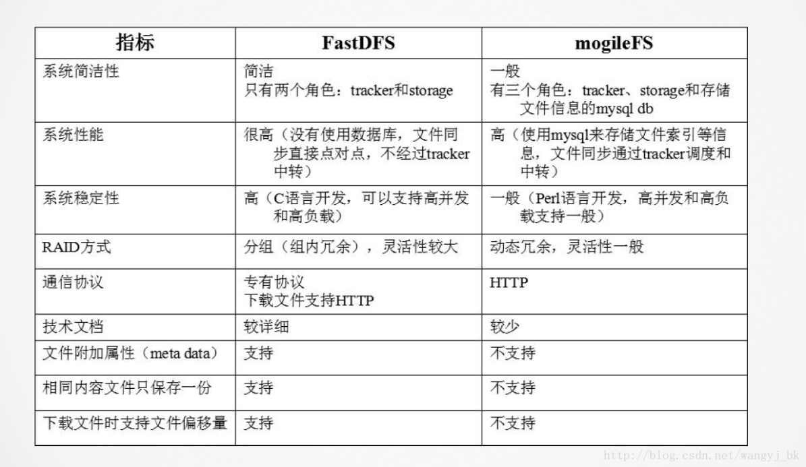
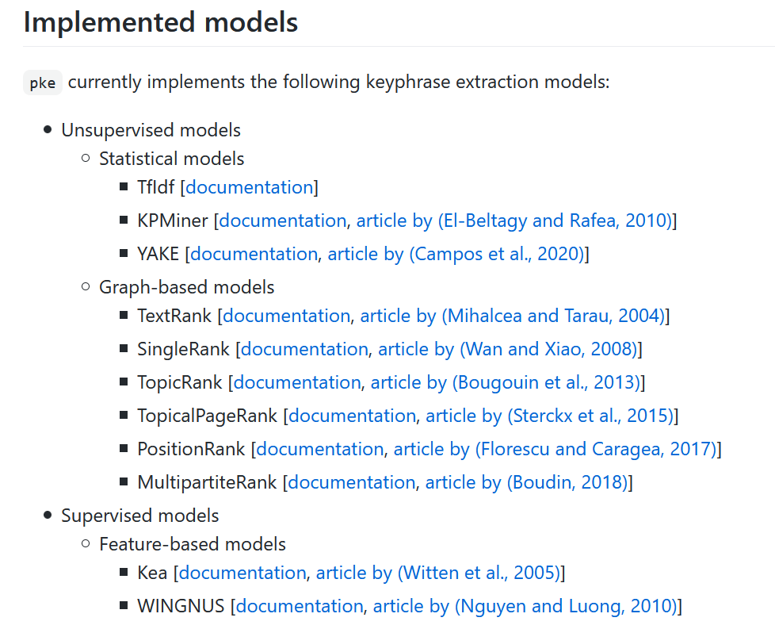
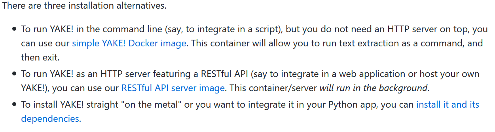
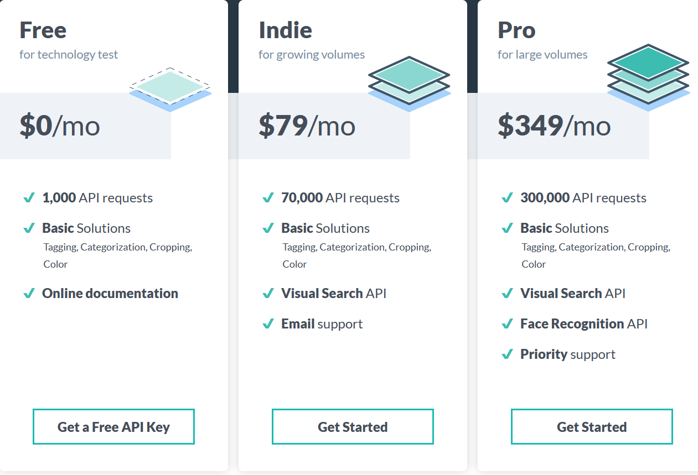
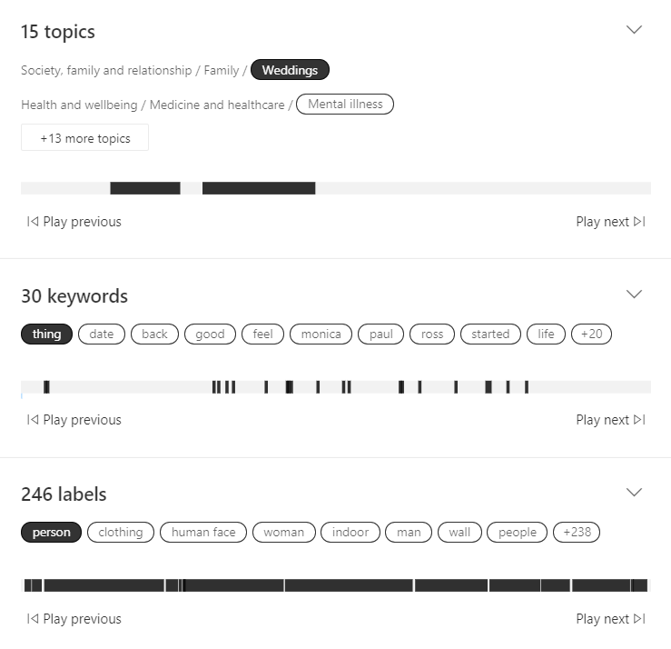
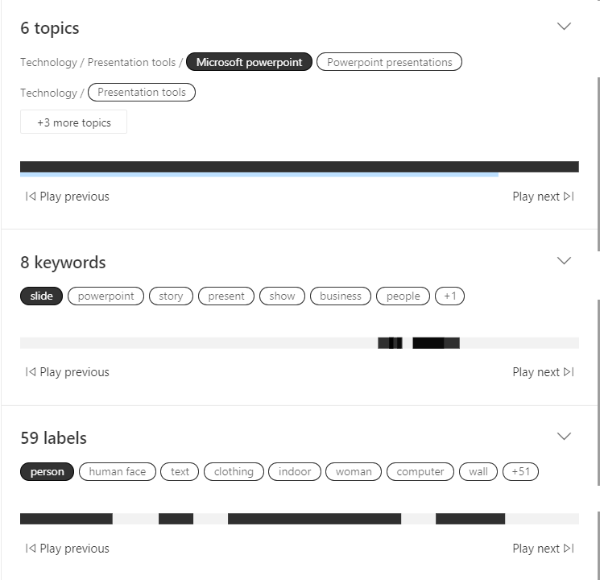

# 调研报告

## 目录

[小组成员](#小组成员)

[项目概述](#项目概述)

[项目背景](#项目背景)

[立项依据](#立项依据)

[前瞻性/重要性分析](#前瞻性/重要性分析)

[相关工作](#相关工作)

[参考文献](#参考文献)

## 小组成员

彭怡腾 彭浩然 朱一鸣 黄晋超 袁玉润

## 项目概述

在信息大爆炸的时代，人类所能够获取和存储的信息量不断增长，这些信息一方面推动了数据驱动型算法的发展，另一方面也对人类自身对这些信息的理解和掌握提出了更高的要求。然而，一个人的记忆能力是十分有限的，相比于他在实际工作所需要接触到的数据量，他的脑容量充其量也只能充当Cache和索引的角色。借助计算机的文件系统，我们能够有效地扩展大脑的“外存”，从而掌控更多的数据。在这个过程中，我们的大脑依靠对某一份信息的“印象”，即其部分标志性的内容，对信息进行索引，并且手动在文件系统中进行查找。

但是，现有的文件系统大多是基于树形结构的，其设计主要面向机器而非用户，而人类的大脑结构决定了他对于某一信息的“印象”通常是零散的、非树形的，因而与现有的文件系统的思维模式产生了冲突。这种冲突的结果是，人类不得不以机器的方式思考，试图将自己思维映射到树形结构上从而适应机器，从而导致人类不能按照自然的思维模式对“外存”中的信息进行检索。在这种思维的扭曲下，分类困难、文件起名困难、找不到文件等令人头疼的问题便层出不穷。

现有的技术也确实在试图缓解这个问题，如Everything、Spotlight、Listary等索引工具都可以依据文件名帮助用户快速找到所需文件。但究其根本，其准确性仍旧完全依赖于用户所起的文件名，即用户为文件提取的“特征”，这些工具并没有解决机器思维与人类思维之间的冲突。

行有不得，反求诸己。试想一个人不会随时随地感到孤独，却每每在看到情侣时会容易联想到单身的自己，这其实是因为他在两件事上发现了一定的关联。由此可见，人类的思维结构事实上很大程度上基于“联想”，即信息与信息之间的“相关性”。要描述这种思维模式，最恰当的模型其实是图，而非树。如果将信息视作节点，那么两个节点就会由于具有共同的特征从而在图中存在一条边。在信息和关联、节点和边的编织下，人脑中呈现出的是一张信息网络。如果我们能以这样的方式管理文件，无疑可以使人类更自然地与“外存”交互，从而在有限的脑容量上提高工作效率。

现有的图文件系统、图数据库文件系统等技术，都是对这种新思路的探索。典型的图文件系统采用算法自动对各种文件进行标记，通过寻找共同的标记进行建图，并且在图数据库中对图进行维护。这些项目说明了图文件系统技术的可行性与各种优点，但是仍然不成熟，能够管理的规模较小，未能投入实用。然而，它的出现却证实了图文件系统是人机交互在未来的一个发展方向。

在这个趋势下，图文件系统的应用必然会走向大型化、团队化。如果说用户在管理GB级别的个人文件时尚可应对，那真正的难题是，当他与数十甚至上百人合作时，要如何共同管理TB乃至更大规模的、由不同人创建和分类的文件。在这种情形下，在个人规模时适用的很多管理方法将会失效。由于人的思维不同，不同人制定的文件名会变得难以检索，目录分类也因人而异。受限于人的脑容量，要对如此海量的信息做到“大致有印象”也变成了一件不可完成的任务。现有的技术无法适配的场景，便是图文件系统最为亟需的突破点。

由此，我们提出构建分布式图文件系统（DisGraFS, Distributed Graph Filesystem），来实现图文件系统在更大规模上的应用。通过主机（Master）对从机（Slave）的存储空间以及算力的合理调度以及在主机的指导下用户与从机之间的直接对接，我们的项目期望实现一个高效的、用户友好的、高可扩展性的分布式图文件系统，以进一步拓展图文件系统在未来应用中的可能性。

## 项目背景

### 文件系统

#### 定义

文件系统是操作系统用于明确磁盘或分区上的文件的方法和数据结构，是在磁盘上组织文件的方法，是操作系统中负责管理和存储文件信息的软件机构。它由三部分组成：与文件管理有关的软件、被管理的文件以及实施文件管理所需要的数据结构。从系统角度来看，文件系统是对文件存储器空间进行组织和分配，负责文件的存储并对存入的文件进行保护和检索的系统。具体地说，它负责为用户建立文件，存入、读出，修改、转储文件，控制文件的存取，当用户不再使用时撤销文件等。

一个分区或磁盘能作为文件系统使用前，需要初始化，并将记录数据结构写到磁盘上，这个过程就叫建立文件系统。

#### 分类

- **磁盘文件系统**

  指本地主机中可以实际访问到文件系统，或者收可以驻留在磁盘上的文件系统，包括硬盘、CD-ROM、DVD、USB存储器、磁盘阵列等。常见文件系统格式有：EXT3、EXT4、VFAT、FAT、FAT16、FAT32、NTFS等。

- **分布式文件系统**

  分布式文件系统（Distributed File System，DFS）是指文件系统管理的物理存储资源不一定直接连接在本地节点上，而是通过计算机网络与节点相连，或是若干不同的逻辑磁盘分区或卷标组合在一起而形成的完整的有层次的文件系统。

  DFS为分布在网络上任意位置的资源提供一个逻辑上的树形文件系统结构，从而使用户访问分布在网络上的共享文件更加简便。单独的 DFS共享文件夹的作用是相对于通过网络上的其他共享文件夹的访问点。

  - **GFS**

    GFS 是 HDFS 的前身。在设计思路上，GFS 设计思路与传统文件系统设计思路完全不同，其中有如下几个特点： 

    1. 组件失效被认为是常态，而不是意外。在分布式环境下，机器硬件失效是常态，所以分
       布式存储系统必须要有容忍硬件失效的机制来保证硬件的失效不会影响系统的正常运行。 
    2. 系统专为大文件设计： I/O 操作以及文件基本存储单位都是基于大文件考虑。
    3. 系统对文件的修改操作主要是在文件末尾进行数据的追加，而不是覆盖原有数据。（优点）

  - **HDFS[^1]**

    HDFS是基于GFS提出的一种文件系统，具有高度容错性，适合部署在廉价的机器上。具有两种架构：中心式架构和联邦式架构，不过看上去中心式架构使用更多。联邦架构是将中心式架构的中心结点横向扩展了。

    优点：高容错性 具有浏览器接口 有java api

    缺点：只支持块写入，不支持随机写（类似于SD卡） 不支持大量小文件存储 数据冗余存储，造成空间浪费（一个块会有三个副本）

  - **MogileFS**

    MogileFS是一个开源的分布式文件系统，用于组建分布式文件集群。它是Google文件系统的C实现。支持多节点冗余 可实现自动的文件复制 使用名称空间（命名空间），每个文件通过key来确定。不需要RAID，应用层可以直接实现RAID，不共享任何东西，通过“集群”接口提供服务 工作于应用层，没有特殊的组件要求。

    优点：提高随机读或写效率和海量小文件的读写效率 提供很多高级特性，类似于Windows的回收站功能，类似于Java语言的垃圾回收机制，快走功能等。轻量，易部署，易修改，易维护。

  - **Lustre[^2]**

    Lustre是一个开源的、基于对象存储OBS( Object - based Storage) 技术的高性能分布式文件系统Lustre基于Linux操作系统实现了标准的POSIX兼容文件系统,采用元数据与存储数据相分离的系统架构减少数据服务器的负载。由于下面的Ceph是基于Lustre的一种优化，故不过多谈论Lustre。

  - **Ceph[^3]**

    Ceph存储系统的设计目标是提供高性能、高可扩展性、高可用的分布式存储服务。它采用RADOS(Reliable Autonomic Distributed Object Store)在动态变化和异构的存储设备集群上,提供了一种稳定、可扩展、高性能的单一逻辑对象存储接口和能够实现节点自适应和自管理的存储系统。数据的放置采取CRUSH算法,客户端根据算法确定对象的位置并直接访问存储节点,不需要访问元数据服务器。（创立者发现元数据的查询和维护严重影响了Lustre，因此制作了Ceph）

    优点：高性能 集群的高可扩展性

    统一存储，适用范围广（支持块，文件和对象存储）

    支持范围广（Linux和ARM架构，可用于移动端）

    接口丰富，包含C，C++，Java，Python，Ruby，PHP等多种语言接口

    缺点：数据分布的均衡性一般 架构复杂，代码耦合度高，版本依赖度高，不同版本之间往往不兼容

  - **MooseFS[^4]**

    MooseFS是基于Linux内核的分布式文件系统，需要调用fuse，但似乎也可使用WSL，MooseFS的工作主要是  MooseFS  客户端对存储服务器文件的读写，MooseFS 前端与 master 服务器发送消息，请求当前待操作数据的存储位置等信息，得到完整信息以后再对该资源进行存取操作，在操作完成以后将数据的操作记录
    发送给 Master 服务器进行同步，meta 服务器在随后也将完成日志的备份工作。 

  - **FastDFS[^5]**

    FastDFS是由国人采用 C 语言开发的一款源码开放的软件，能够在类 UNIX系统上很好的工作。与其他应用级的分布式文件系统比较而言，它是一款量级较轻的软件，能够满足大量用户的并发访问的需求以及存储大量的文件，在客户端发送存取文件请求时，负责调度的服务器按照选择好的算法将请求分配到存储服务器上。通过提供 API 完成文件的上传、下载、删除以及修改等操作，实现对文件的管理。 
    
    FastDFS 支持对存储服务器在线扩容，相同内容的文件只保存一份，这样就大
    大的节省了存储空间。适用于为中小型企业提供存储服务，如存储文档、图片、
  多媒体文件等。 
    
    它和MogileFS文件系统较相似，如图：
    
    
    
    它和HDFS对比：Hadoop分布式文件系统是为处理流式访问大文件提出的，在处理大量小文件上，效率很低，会导致内存空间不足和Block内存空间的大量浪费，并随着小文件数量的增加，文件的检索速度会受影响。
  
- **虚拟文件系统**

  虚拟文件系统(VFS)是由Sun microsystems公司在定义网络文件系统(NFS)时创造的。它是一种用于网络环境的分布式文件系统，是允许和操作系统使用不同的文件系统实现的接口。虚拟文件系统（VFS）是物理文件系统与服务之间的一个接口层。严格说来，VFS并不是一种实际的文件系统。它只存在于内存中，不存在于任何外存空间。VFS在系统启动时建立，在系统关闭时消亡。	

- **用户态文件系统**

  用户态文件系统是指完全在用户态实现的文件系统，传统上操作系统在内核层面上对文件系统提供支持。而通常内核态的代码难以调试，生产效率较低。而在用户态实现文件系统能够大幅度提高生产率，简化了为操作系统提供新的文件系统的工作量，但就性能和效率的角度来说，用户态文件系统相比于经过内核的文件操作对于性能的提升并不多[^6]

  - **LINUX下用户态文件系统框架：FUSE**

    FUSE是一个实现在用户空间的文件系统框架，通过FUSE内核模块的支持，使用者只需要根据fuse提供的接口实现具体的文件操作就可以实现一个文件系统。 
    
    在fuse出现以前，Linux中的文件系统都是完全实现在内核态，编写一个特定功能的文件系统，不管是代码编写还是调试都不太方便，就算是仅仅在现有传统文件系统上添加一个小小的功能，因为是在内核中实现仍需要做很大的工作量。在用户态文件系统FUSE出现后，就会大大的减少工作量，也会很方便的进行调试。编写FUSE文件系统时，只需要内核加载了fuse内核模块即可，不需要重新编译内核。
    
  - **WINDOWS下用户态文件系统框架：DOKAN**
  
    Dokan Library 帮助程序员在windows系统下轻松建立用户级文件系统，不需要写设备驱动，其与FUSE（Linux user mode file system）类似。
  
- **数据库文件系统**

  DBFS 就是 Oracle 11gR2 中提供的能够在 Linux 操作系统中将 Oracle 数据库当成文件系统来使用的功能。在 DBFS 内部，文件是以 SecureFiles LOBs的形式存储在数据表中。上一届的GBDFS项目就是基于数据库文件系统DBFS，将数据库文件系统改进成为了图数据库文件系统。

### 图数据库

#### 定义

图数据库用图来存储数据，是最接近高性能的一种用于存储数据的数据结构方式之一。

- **图数据库**（graph database）是一个使用图结构进行查询的数据库，它使用节点、边和属性来表示和存储数据。该系统的关键概念是**图**，它直接将存储中的数据项，与数据**节点**和节点间表示关系的**边**的集合相关联。这些关系允许直接将存储区中的数据链接在一起，并且在许多情况下，可以通过一个操作进行检索。图数据库将数据之间的关系作为优先级。查询图数据库中的关系很快，因为它们永久存储在数据库本身中。可以使用图数据库直观地显示关系，使其对于高度互连的数据非常有用。
- **节点**：构成一张图的基本元素是节点和关系，节点和关系都可以附带属性。
- **关系**：通过关系可以找到很多关联的数据，比如节点集合，关系集合以及他们的属性集合。
- **属性**：节点和关系都可以设置自己的属性。 属性是由Key-Value键值对组成，键名是字符串。
- **路径**：路径由至少一个节点，通过各种关系连接组成，经常是作为一个查询或者遍历的结果。
- **遍历**：遍历一张图就是按照一定的规则，跟随他们的关系，访问关联的的节点集合。


#### 几种主流的图数据库介绍

- #### Neo4j[^11]

  - Neo4j是一个高性能的NOSQL图形数据库，它将结构化数据存储在图上而不是表中。它是一个嵌入式的、基于磁盘的、具备完全的事务特性的Java持久化高性能引擎，该引擎具有成熟数据库的所有特性。

  - 数据流架构：

    

  - 使用查询语言cypher：
    - 对比命令式语言如Java和脚本语言如Gremlin和JRuby，它的焦点在 于从图中如何找回，而不是怎么去做。这使得在不对用户公布的实现细节里关心的是怎么优化查询。
    - Cypher的语法提供了一种视觉和逻辑的方式来匹配图中节点和关系的模式。它是一种声明性的，基于 SQL的语言，用于使用ASCII-Art语法描述图形中的视觉模式。
  - **主要优势**：生态较为完整，提供多种API接口；层数较低时查找效率可观；使用量大，有较多资料和工具。
  - **劣势**：层数较多时查找较慢；非分布式储存。

- #### TigerGraph[^12]

  - TigerGraph是一款“实时原生并行图数据库”，既可以部署在云端也可以部署在本地，支持垂直扩展和水平扩展，可以对集群中的图数据自动分区，遵循ACID标准，并且提供了内置的数据压缩功能。它使用了一种消息传递架构，这种架构具备了可随数据增长而伸缩的并行性。

  - 架构：

    

  - 使用新的查询语言GSQL，有以下特点：

    - 多部路径遍历：GSQL 支持分析规范，这些分析涉及在图中遍历多步路径，同时沿着路径传播计算出的中间结果。
    - 假定预定义模式：GSQL 假定一个预定义模式，并将其作为元数据存储在数据库目录中。这可提高存储和访问效率，因为模式元数据可从点/边/属性表示中分解出来。这使性能得以提高，不仅因为节省了空间，还因为在预先更深入了解数据模型后，可进一步优化查询：更多筛选、更好的排序、更多捷径等。

  - **主要优势**：查询效率最高（在多层查找和数据量庞大时优势明显），分布式储存。

  - **缺陷**：图创建好后只能手动在现有图上进行增添或删去；GSQL语法规则复杂，学习成本高；Tigergraph生态不是很全，编程API接口有一定的限制。

- #### Azure Cosmos DB

  - Azure Cosmos DB 是一种用于新式应用开发的完全托管的 NoSQL 数据库。 在高吞吐量、大规模的数据集上的表现良好。作为一项完全托管的服务，Azure Cosmos DB 使用自动管理、更新和修补，使你无需进行数据库管理。 它还通过经济高效的无服务器和自动缩放选项处理容量管理，这些选项可响应应用程序的需求，使容量与需求相匹配。
  - 使用Gremlin语言。
  - **优势**：支持多个平台；模拟器在本地可完成大部分任务；使用开源 API、多个 SDK、无架构数据和对操作数据的无 ETL 分析进行快速构建；除了图之外还有多种储存模式。
  - **劣势**：图的可视化需要集成Linkurious Enterprise；使用云服务需要用visa信用卡进行注册。

- #### 其他

  - Hugegraph：原生的可视化工具，**一键部署**，支持多图管理、图查询、数据导入、schema复用。
  - ArangoDB：插入新节点时算力消耗较大但查找和索引较快；用内存换取效率；支持的操作系统多。

#### 几种数据库的比较

- #### 主要特性对比

  | 图数据库          | Neo4j                                                        | Azure Cosmos DB                                              | TigerGraph                                                   | JanusGraph                                                   |
  | ----------------- | ------------------------------------------------------------ | ------------------------------------------------------------ | ------------------------------------------------------------ | ------------------------------------------------------------ |
  | 描述              | 开源图数据库                                                 | 全球分布式、水平可拓展、多模型数据库服务                     | 支持实时网络规模数据分析的完整、分布式、并行图形计算平台     | 分布式集群优化的图形数据库                                   |
  | 服务器操作系统    | Linux<br/>Solaris<br/>Windows                                | 仅基于云端                                                   | Linux                                                        | Linux<br/>Windows<br/>OS X                                   |
  | 使用许可          | 社区版开源                                                   | 免费用户享受5G以内的数据服务（需要visa行用卡进行认证）；提供仅限于本地的模拟器 | 容量小于50G、社区支持的免费许可证；原厂支持、容量大的企业版需付费以获得许可 | 完全开源                                                     |
  | 实现语言          | Java   Scala                                                 |                                                              | C++                                                          | Java                                                         |
  | API和其他访问方法 | Bolt protocol;<br/>**Cypher query language;**<br/>Java API;<br/>Neo4j-OGM;<br/>RESTful HTTP API;<br/>Spring Data Neo4j;<br/>TinkerPop 3 | DocumentDB API;<br/>**Graph API (Gremlin);**<br/>MongoDB API;<br/>RESTful HTTP API;<br/>Table API | **GSQL (TigerGraph Query Language);**<br/>Kafka;<br/>RESTful HTTP/JSON API | Java API;<br/>TinkerPop Blueprints;<br/>TinkerPop Frames;<br/>TinkerPop Gremlin;<br/>TinkerPop Rexster |
  | 技术文档          | https://neo4j.com/docs/                                      | https://docs.microsoft.com/azure/cosmos-db/                  | https://docs.tigergraph.com/                                 | [docs.janusgraph.org](https://docs.janusgraph.org/)          |
  | 安装              | 在Linux上安装对安装环境有依赖；支持多个平台使用              | 本地模拟器安装和使用较为方便；使用云服务器需要用visa注册Azure账号 | 仅在linux上运行，对安装环境有依赖                            | 提供Docker image（使在单台机器上运行服务器和客户端变得更加容易，而无需处理多个安装） |

- #### 目前各大图数据库使用趋势[^13]

  

  

### 文件操作接口

#### C++ filesystem库

C++17后加入的filesystem库比较完整地支持了各种文件操作。提供了`file`、`path`、`directory_entry`、`directory_iterator`等对象，可以方便地完成文件夹的访问、遍历等操作。

- #### 安装

  C++17标准库，无需安装

  ```c++
  #include <filesystem>
  using namespace std::filesystem
  ```


- #### 适用平台

  一切支持C++17标准编译器的平台均可使用，Windows、Linux和Max都能正常使用。针对不同系统路径中斜杠方向（正斜杠`/`和反斜杠`\`）的区别，可以忽略其差别自动适应，无需为不同的平台重复编写代码。但由于C++是编译型语言，代码需要在不同的平台下分别编译后才能使用。

#### Java 文件系统API

Java 7引入了新的输入/输出2（NIO.2）API并提供了一个新的 I/O API。它向Java类库添加了三个包：java.nio.file，java.nio.file.attribute和java.nio.file.spi。它同样提供了基本的`File`、`Path`等对象，方便文教操作。值得一提的是，它同时还提供了异步文件读写的支持`java.nio.channels.AsynchronousFileChannel`。

- ##### 安装

  Java API，无需安装

  ```
  import java.nio.file;
  import java.nio.file.attribute;
  import java.nio.file.spi;
  ```


- ##### 适用平台

  基于Java虚拟机，适用于各种平台。底层依赖于系统提供的文件接口。

  另外，虽然Android基于Java，但由于Android平台下的权限管理等机制，文件读写的操作主要依赖Android提供的API。

#### Python os库

Python的os库并不是专门用来管理文件系统的库，而是包含了各种操作系统相关杂项接口的集合。其中os.path提供了一些基本的文件操作，如判断文件存不存在、判断文件/目录类型等，但并不很好地从面向对象的层面支持文件系统。

- ##### 安装

  内置库，无需安装

  ```python
  import os
  from pathlib import Path
  ```


- ##### 适用平台

  Python 3.4新加入的pathlib弥补了上述的一些不足。它用面向对象的方式描述路径，并且对POSIX路径和Windows路径做出了区分。但是，各种路径均有共同的基类，因此在实际操作时也可以使用基类而对平台不做区分。但总体而言，其对各种文件操作的支持弱于C++。

### 文件系统监控

#### Linux inotify

inotify是Linux提供的一个监控文件系统的底层API，可以细粒度地监控文件系统的改动，详细地返回事件的类型等信息。inode可以作为terminal命令使用，也可以作为一个C函数使用，使用方法如下：

```c
#include <sys/inotify.h>
```

由于inotify是原生API，所以具有较高的效率，但是依赖于inotify的代码只能在Linux下运行，无法做到跨平台。

#### Windows FileSystemWatcher

相应地，微软也提供了原生API监控文件操作。`FileSystemWatcher`类支持C++、C#、VB等Windows平台开发常用语言，可以较高效地支持文件更改、创建、删除和重命名等操作的监控。

```c++
#include <Windows.h>
```

同样地，使用该类需要包含操作系统专用的库，因而无法跨平台使用。

#### ReadDirectoryChangesW

Windows还提供了一个类似的函数ReadDirectoryChangesW实现文件系统监控。相比于面向对象的FileSystemWatcher，ReadDirectoryChangesW的接口更难使用，但功能是类似的。

#### C++

目前，C++下没有很好的跨平台文件系统监控库。如果有需要，可以手动使用filesystem标准库 + 轮询的方式实现，但这样效率非常低。

#### Java WatchService

Java 7新提供的neo库在支持文件系统基础操作的同时，也提供了一定的监控功能。大多数文件系统对文件进行修改的时候支持通知本机，即用原生接口来检测文件修改，因而效率较高。当文件系统不支持这种机制的时候，监视器服务将轮询文件系统，等待事件。

```
WatchService watchService = FileSystems.getDefault().newWatchService();
Path dir = Paths.get(path);
WatchKey key = dir.register(watchService, ENTRY_CREATE, ENTRY_MODIFY, ENTRY_DELETE); 
key = watchService.poll();
```

#### Python WatchDog

`Watchdog`是一款用于监控文件系统事件的Python库，对不同平台的事件进行了封装。`Watchdog`优先使用底层原生API，其次再通过轮询磁盘实现监控，目前支持以下操作系统：

- Windows：ReadDirectoryChangesW
- Linux 2.6+：inotify
- Mac OS X：kqueue或FSEvents
- BSD Unix variants：kqueue

可以看到先前提到过的ReadDirectoryChangesW和inotify等函数在此处都会被优先使用，因而WatchDog理论上也具有较高的效率。

WatchDog是一个第三方包，仅支持Python3.4+，需要另外安装：

```
pip install watchdog
```

WatchDog使用观察者模型，主要有observer、event_handler和被监控的文件夹三个角色，使用相对简单。

```python
import time
from watchdog.observers import Observer
from watchdog.events import FileSystemEventHandler


class MyHandler(FileSystemEventHandler):
    def on_any_event(self, event):
        print(event.event_type, event.src_path)


event_handler = MyHandler()
observer = Observer()
observer.schedule(event_handler, path='.', recursive=False)
observer.start()
try:
    while True:
        time.sleep(0.1)
except KeyboardInterrupt:
    observer.stop()
observer.join()
```

相应地得到类似下面的运行结果：

```
created .\a.txt
modified .\a.txt~
modified .\a.txt
moved .\a.txt
deleted .\b.txt
```

### 文件自然属性提取(打标签)

由于本课程的定位为操作系统课程，我们的大作业项目自然也应以系统设计为主要的工作，而不应在一些细枝末节上耗费过多时间，故在给文件打标签这项任务上，我们应以尽可能利用现有的技术为宗旨。但在为各种不同的文件类型选择打标签的应用时，也应广泛地调研各种备选项，权衡优劣，选择更适合于整个系统，更贴合项目预期目标的应用。

#### 针对各种文件类型的打标函数库\接口

##### 纯文本文件

- **TextRank4ZH**

  - 实现语言：python（2.7.9于3.4.3中均测试通过）

  - 安装难易：易

  - 特色：支持中文

- **pke**

  - 实现语言：python（只支持3.6+）

  - 安装难易：易

  - 特色：具备多种关键词提取模型，能胜任多种场景

  

- **yeke**

  - 实现语言：python

  - 安装难易：易

  - 特色：支持任何大量语种；

  ​			有移动端应用；

  ​			有多种安装方案：

  

##### 图片文件

- **Google Cloud Vision API**

  - 效果：经笔者测试，识别准确率较高

  - 价格：

    | 功能                     |       每 1000 个单元的价格       |                                                |                                                              |
    | ------------------------ | :------------------------------: | ---------------------------------------------- | ------------------------------------------------------------ |
    | 每月的前 1000 个单元     | 每月的第 1001 - 5,000,000 个单元 | 每月的第 5,000,001 个单元及之后的单元          |                                                              |
    | 标签检测                 |               免费               | $1.50                                          | $1.00                                                        |
    | 文本检测                 |               免费               | $1.50                                          | $0.60                                                        |
    | 文档文本检测             |               免费               | $1.50                                          | $0.60                                                        |
    | 安全搜索（露骨内容）检测 |               免费               | 若购买了标签检测服务，此功能免费；否则为 $1.50 | 若购买了标签检测服务，此功能免费；否则为 $0.60               |
    | 人脸检测                 |               免费               | $1.50                                          | $0.60                                                        |
    | 人脸检测 - 名人识别      |               免费               | $1.50                                          | $0.60                                                        |
    | 地标检测                 |               免费               | $1.50                                          | $0.60                                                        |
    | 徽标检测                 |               免费               | $1.50                                          | $0.60                                                        |
    |                          |                                  |                                                |                                                              |
    | 图片属性                 |               免费               | $1.50                                          | $0.60                                                        |
    | 剪裁提示                 |               免费               | 若购买了图片属性服务，此功能免费；否则为 $1.50 | 若购买了图片属性服务，此功能免费；否则为 $0.60               |
    | Web 检测                 |               免费               | $3.50                                          | [请联系 Google 了解详情](https://cloud.google.com/contact?hl=zh-cn) |
    | 对象本地化               |               免费               | $2.25                                          | $1.50                                                        |

- **Bing Visual Search API**

  - 效果：与Google Cloud Vision API差不多

  - 价格：每月前1000次调用免费，后续开始梯度收费

- **imagga**

  - 效果：经笔者测试，这款API只能标一些比较宽泛的词，但它提供了多个关键词及相应的可信度，这点要好于前两者。

  - 价格：

    

##### 音频文件

- **Google Cloud Speech-to-Text**

  - 优点：支持多种语言，抗音频中噪音干扰能力强

  - 缺点：超过一定限额开始收费

- **Microsoft Speech-to-Text**

  - 优点：可定制词汇

  - 缺点：一样要收费

- **Dialogflow**

  - 优点：免费，能够分析语境

  - 缺点：支持的语言数较少

- **Speechmatics**
  - 功能极其强大，但每次使用都要收费

##### 视频文件

用户视频一般可分为2类：a)现成视频资源，如电影、电视剧、新闻 b)由个人拍摄的视频。

对第一类视频文件，理想的标签效果是影视作品的相关信息，而非对视频内容的解析。因此，我们需要在网络中寻找到对应视频以获取信息，是一个视频搜索的过程。对第二类文件，标签应基于视频内容。

具体可行方法由以下给出。

###### 视频搜索

提取关键帧，对关键帧进行图片搜索（如google图片搜索，TinEye等），根据结果推断出视频相关信息。

[Example](https://www.gainchanger.com/reverse-video-search/)

###### Video Content Analysis

小视频完整上传，大视频压缩后上传/提取关键帧后识别内容

* 依赖：pycrypto, Python SDK  
  
* 价格：6元/小时（视频时长）  
  
* Demo：  
  
* [Microsoft Video Indexer](https://vi.microsoft.com/zh-Hans)

  * Pros  
  
* 功能丰富，识别准确，调用便捷（无依赖库安装，登录后使用access token获取服务）
  
  * Cons  
  
  * 价格
    
  |            | Video Analysis | Audio Analysis |
  | ---------- | -------------- | -------------- |
  | per minute | 0.15$          | 0.04$          |
  
  * Demo
  
    1. 电视剧：老友记
       
    2. 官方Sample：Office宣传片
       
       关键帧：
       

#### 标签模糊搜索

由于标签生成时可能出现2个同义标签的情况，标签搜索中需对关键字模糊化，以避免匹配标签未被查询到的情况。

##### WordNet

WordNet是一种基于认知语言学的英语词典，它将单词按照单词的意义和词与[词之间的关系](https://wordnet.princeton.edu/#page-page:~:text=unique.-,Relations,There%20are%20only%20few%20adverbs%20in%20WordNet%20(hardly%2C%20mostly%2C%20really%2C%20etc.)%20as%20the%20majority%20of%20English%20adverbs%20are%20straightforwardly%20derived%20from%20adjectives%20via%20morphological%20affixation%20(surprisingly%2C%20strangely%2C%20etc.))组成一个“单词的网络”。
目前最成熟的WordNet系统是[Princeton WordNet](https://wordnet.princeton.edu/), 可以使用python-NLTK调用，但只支持英文。

也有若干针对中文的WordNet系统：[Chinese Open Wordnet](http://compling.hss.ntu.edu.sg/cow/), [Chinese WordNet](http://www.openkg.cn/dataset/chinese-wordnet).  

利用WordNet构建的网络关系，我们可以计算出词与词间的相似度（与基于预料的方法不同），还可以得到词之间的从属关系（如“椅子”与“椅背”的关系），从而可能解决搜索"cat"时无法得到标记有猫的学名标签的问题。

##### 基于语料的方法

除以上基于WordNet方法外，另一种方法是利用已训练好的模型得到语义相似度评分。
[百度-词义相似度](https://ai.baidu.com/tech/nlp_basic/word_emb_sim)  

[百度-词向量表示](https://ai.baidu.com/tech/nlp_basic/word_embedding)

## 立项依据

当前主流的分布式文件系统如：MooseFS，FastFS，Ceph等只关注了文件的海量存储特性，文件查询搜索的效率将随着文件量级的上升成为一个棘手的问题。而往届的图数据库文件系统，只着眼于单机文件所建立其的图结构，使用机器打标，隔离了用户对图节点（即文件属性）的修改操作。

但事实上，在单机方面，通常是单个用户使用，因此用户按照自己的理解创立的文件名在索引方面相比于机器命名有着更大意义，而在分布式的多用户系统上面才更加需要隔离用户的概念，也需要有一种统一的机器思维的方法便于不同的用户去搜索文件。

DisGraFS为改善上述问题，提出了分布式图文件系统的概念，统一了单机图文件系统和分布式文件系统的优点。将图的结构与思想应用于分布式文件系统上面，使不同设备的文件之间能够得以建立起关联，便于不同用户在大量文件中方便快捷的查询搜索。


## 前瞻性/重要性分析

#### 大规模应用下的人机交互改进

随着人类掌握的信息量的不断提升以及大规模系统中不同用户共享数据需求的提升，如何有效地管理海量数据并在更大的规模下保持乃至提升人机交互体验，是当今大数据时代对计算机系统提出的新的课题。人类的工作离不开计算机的算力与存储，而计算机的发展也离不开人类的思维，但当两种不同思维相冲突时，人机交互的有效性将会成为人类所掌控的信息量进一步扩大的瓶颈。分布式图文件系统希望能够突破这个瓶颈，为大数据时代的进一步发展提供稳固的基础设施。

#### 同时实现存储和算力的合理分布

如今分布式存储和分布式计算趋于热门，而作为一个对存储和算力均有要求的应用，分布式图文件系统希望通过合理的调度算法实现对存储和算力的均衡分配，从而降低系统负担，更好地适应分布式场景。

#### 跨平台与高可扩展性

通过使用本身支持跨平台的技术，分布式图文件系统希望做到对设备（主机、从机）平台要求的最小化和对用户环境要求的最小化，从而使得大多数设备都可以方便地接入系统，起到整合边缘资源、提高扩展性的作用，为其在未来将会面临的大规模、复杂场景应用扫清障碍。

## 相关工作

### 数据库文件系统

不同于一般的基于层次结构的文件系统，数据库文件系统按照文件的特性对其进行管理，如主题、作者及其元数据信息。

#### sf.net[^7]

DBFS最先由University of Twente的Onne Gorter进行开发，现已成为sf.net项目。如今KDE的core中已经加入了DBFS，打开文件和保存文件界面已经被DBFS替代，然而其底层始终是传统的层次化文件系统，只是向用户呈现出了DBFS的表象。

sf.net的这个项目最开始是为了实现使用户能够通过文件的各种特征来找到文件的便捷性。例如，当用户需要找到一个文件，那么这个DBFS将向用户收集该文件的信息，其中包括但不限于：这个文件上个月被编辑过吗？这个文件是否是一个文字文档？这个文件是否属于某个特定的项目？有了这样一些问题，DBFS的搜索范围逐渐减小，最终确定在一些文件上，甚至能直接定位到用户想要的文件。

相较于传统的文件系统使用的目录结构，DBFS中更多地使用关键词。并且在DBFS中，这样的一些关键词更像是目录的超集。

此外, sf.net项目中的DBFS还有几个比较重要的设计。首先是，DBFS不存储系统文件，也就是它不存储libraries，或字体文件等。主要原因是这些都不是文档，不是日常生活中会去查找的，也不太方便在DBFS中存储。其次，一些应该在一起的文件，应该视为一个文档。举例来说，一个音乐文件，它的对应的歌词文件应该和这个音乐文件绑定在一起作为一个文档；或者一部电影有两个部分，这两个部分虽然是两个文件，但在DBFS中也应该被视为一个文档。


有许多项目[^8]并非纯粹的数据库文件系统，但他们用到了数据库文件系统的一些方面：

1. Web content management system

   许多web内容管理系统使用relational DBMS来存储和检索文件。例如，SQL SELECT 语句检索文件允许使用复杂的逻辑及比普通的文件系统更丰富的信息进行关联。

2. 一些超大型文件系统如Apache Hadoop, Google File System同样使用了数据库文件系统中的概念。

### 基于语义的文件系统

#### Semantic File System

Semantic File System 根据数据的语义及用途来组织文件，而非传统的文件地址。它允许通过文件内容来查询文件。传统的层级文件系统给用户维护文件带来巨大的负担。Semantic File System通过文件标签减轻了用户负担并提供了一种符合直觉的文件搜索方式。

语义文件系统遇到的一大难题便是给文件提供适当的语义标签。并且，为维护标签的有效性，在文件被修改后文件系统需及时更新、建立或删除标签。

#### TagFS[^9]

为解决传统的层级文件系统无法帮助人们组织文件的问题，TagFS允许用户自行添加标签，并对标签进行语义上的搜索。在文章中，作者分析了严格层级结构的文件系统和基于标签的文件组织方式之间的语义区别。基于以上调查，作者将无分级的标签系统与语义查询映射到常用 的层级文件系统，结合了二者的优势。

#### Graph File System

University of Pisa的Daniele Di Sarli建立了一种图文件系统(GFS)。主要的思想是将基于路径的层级定位代替以语义。换句话说，路径不再被视为目录有序列表，而是被视为一个集合。这样一来，要取得一个文件，就不再需要记住属性顺序。此外，它也改进了SIL(Semantic instead of Location)需要得到所有tags才能找到一个文件的缺陷。

而这个GFS设计中，作者认为并不能完全抛弃系统文件夹这样的传统特性。此外，为了减轻用户手工标记的工作量，文件系统必须提供分配多个标记以及同时标记多个文件的自然方法。GFS可以看作是一个标准的文件系统，在其任何一个位置，用户都可以创建标准目录(standard directory)或者语义目录(semantic directory)。标准目录有自己的名称空间，并且与传统的文件系统相同，其行为与其直接祖先(direct ancestor)的类型无关；语义目录以一个标准目录作为其直接祖先，并在此目录中定义了新的语义空间(semantic space)。此外，每个语义子目录均定义了一个标签。

最关键的地方是语义目录的管理方式：语义空间可以建模为一个直接连接的Ego Graph，其中入口点是中心，标签是其他节点。一旦创建了一个新标记，就创建了从入口点到入口点的两条边。此外，新标记与路径中到入口点的所有标记进行双重链接。在语义空间中创建标准目录将导致退出此空间。这使语义空间与标准层次结构交替成为可能。这种机制的一个使用示例可能是这样的情况:用户希望自己的主目录是语义目录，但他们也希望音乐有一个单独的名称空间，工作文档有一个名称空间，日志文件和下载有一个标准行为。

### 分布式文件系统

#### Hadoop distributed file system[^10]

在Hadoop分布式文件系统（HDFS）是一个分布式，可扩展和可移植的文件系统用Java编写的Hadoop框架。其拥有以下5个服务，其中前3个为Master services，后2个为slave services：

1. Name Node

   HDFS仅包含一个称为“主节点”的名称节点。主节点可以跟踪文件，管理文件系统，并在其中具有所有已存储数据的元数据。特别是，名称节点包含块数，存储数据的数据节点的位置，复制的存储位置以及其他详细信息的详细信息。名称节点直接与客户端联系。

2. Secondary Name Node

   这仅是为了照顾Name Node中文件系统元数据的检查点。

3. Job Tracker

   接受来自客户端的Map Reduce请求，并与Name Node沟通以获知数据具体存储位置。

4. Data Node

   数据节点将数据作为块存储在其中。它将实际数据存储到HDFS中，HDFS负责客户端读取和写入。每个Data Node每3秒向“Name Node发送一个Heartbeat消息，并传达该消息处于活动状态。这样，当Name Node在2分钟内未从数据节点接收到心跳时，它将将该数据节点视为已失效，并开始在其他某个Data Node上进行块复制的过程。

5. Task Tracker

   Job Tracker的从节点，从Job Tracker接受任务。

   HDFS将大型文件分布地存储在多个机器，并通过复制数据来实现可靠性的要求，理论上无需主机上的RAID存储。

#### Ceph

Ceph存储系统的设计目标是提供高性能、高可扩展性、高可用的分布式存储服务。它采用RADOS(Reliable Autonomic Distributed Object Store)在动态变化和异构的存储设备集群上,提供了一种稳定、可扩展、高性能的单一逻辑对象存储接口和能够实现节点自适应和自管理的存储系统。数据的放置采取CRUSH算法,客户端根据算法确定对象的位置并直接访问存储节点,不需要访问元数据服务器。

## 参考文献

[^1]: 王磊 HDFS文件系统升级方案的研究与实现 南京邮电大学硕士学位论文 2020
[^2]: 黄永胜 分布式文件系统Lustre的研究  东北大学硕士学位论文 2020
[^3]: 张晓 张思蒙等 Ceph分布式存储系统性能优化技术研究综述 计算机科学 2021
[^4]: 姚孝珍 云平台下基于MooseFS的网盘系统架构及关键技术的设计与实现 电子科技大学硕士学位论文 2020
[^5]: 刘俊强 基于FastDFS云存储系统的研究与设计 电子科技大学硕士学位论文 2016
[^6]: 杨洪章 杨雅辉等 基于用户态文件系统的共享访问与性能提升研究 北京大学学报 2020,56(06)
[^7]: [Database File System](http://dbfs.sourceforge.net/)
[^8]: [Database File System Wikipedia](https://en.wikipedia.org/wiki/File_system#Database_file_systems)
[^9]: [TagFS]([https://www.semanticscholar.org/paper/TagFS-Tag-Semantics-for-Hierarchical-File-Systems-Bloehdorn-G%C3%B6rlitz/974c473825c7186fddb2d14a63ea30f44a369bc8](https://www.semanticscholar.org/paper/TagFS-Tag-Semantics-for-Hierarchical-File-Systems-Bloehdorn-Görlitz/974c473825c7186fddb2d14a63ea30f44a369bc8))
[^10]: [HDFS wikipedia](https://en.wikipedia.org/wiki/Apache_Hadoop#HDFS)

[^11]: [neo4j documentation](http://neo4j.com.cn/public/docs/index.html) ↩
[^12]: [tigergraph](https://docs.tigergraph.com/)
[^13]: [DB ENGINE](https://db-engines.com/en/ranking/graph+dbms)