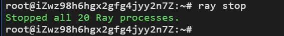

## ray安装

Ubuntu20.04下的安装步骤

1.检查python版本：尽量安装python最新版本，同时确保header和worker的python版本相同。

2.如有pip，跳过此步，否则按如下安装pip：

```shell
curl https://bootstrap.pypa.io/get-pip.py -o get-pip.py
sudo python3 get-pip.py
```

3.更新

```shell
sudo apt update
```

4.安装ray最新发行版

```shell
pip install -U ray
pip install 'ray[default]' #美化cli界面
```

## ray cluster搭建

前提要求：各台服务器在**同一个局域网**中，安装有**相同版本的python和ray**。

### header节点

```shell
ray start --head --port=6379
```

预期看到以下界面


### worker节点

输入header节点创立后，命令行提示中Next steps下面的第二行，

```shell
ray start --address='172.30.239.56:6379' --redis-password='5241590000000000' #视实际情况修改address
```

预期看到以下界面


如果要退出集群，只需

```shell
ray stop
```

预期看到以下界面



## tagging程序依赖包安装

默认配置为清华源

```shell
pip install pdfplumber
pip install sphinx
pip install ffmpeg
pip install SpeechRecognition
pip install tinytag
pip install pydub
python -m nltk.downloader stopwords
python -m nltk.downloader universal_tagset
python3 -m spacy download en
pip install git+https://github.com.cnpmjs.org/boudinfl/pke.git #请确保以安装好git;从cnpmjs下载是为了防被墙，若可科学上网，可换为pip install git+https://github.com/boudinfl/pke.git
```

